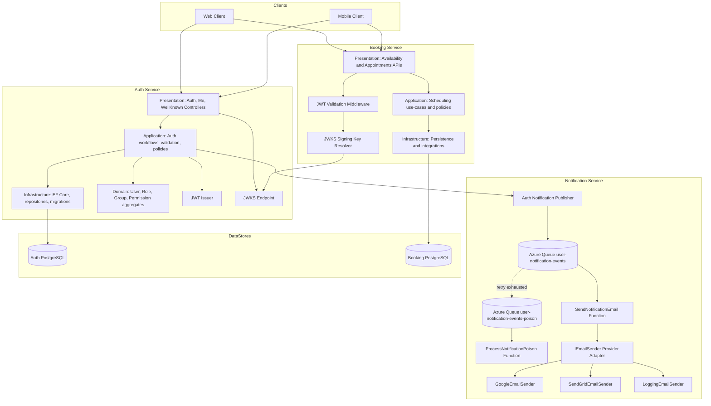

# Auth, Booking, and Notification Components View

Purpose: Present the runtime component topology for identity, scheduling, and asynchronous notification delivery.
Status: CURRENT - Reflects implemented Auth, Booking, and Notification integration.

---

## 1. Component Architecture

## 2. Design Intent

- Auth service is the identity provider and token issuer.
- Booking service is a protected resource API and validates JWT locally.
- Notification service is an async worker pipeline for delivery side effects.
- Signing keys are discovered through JWKS and reused for token verification.
- Persistence boundaries remain separate between identity, scheduling, and delivery concerns.

## 3. Responsibilities by Service

### Auth Service
- User sign-up with email verification required before password login.
- Two-step password login (credential challenge then code verification).
- Google login with provider verified-email evidence checks.
- Me endpoint for current principal.
- JWKS publication for downstream trust.
- Role/group/permission graph management.

### Booking Service
- JWT authentication and authorization policy enforcement.
- Availability and appointment business workflows.
- Scheduling data consistency and persistence.

### Notification Service
- Async queue-triggered notification processing.
- Provider abstraction for delivery channels (`IEmailSender`).
- Structured provider diagnostics (status, provider message ids, response body).
- Retry/dead-letter behavior with dedicated poison queue processor.
