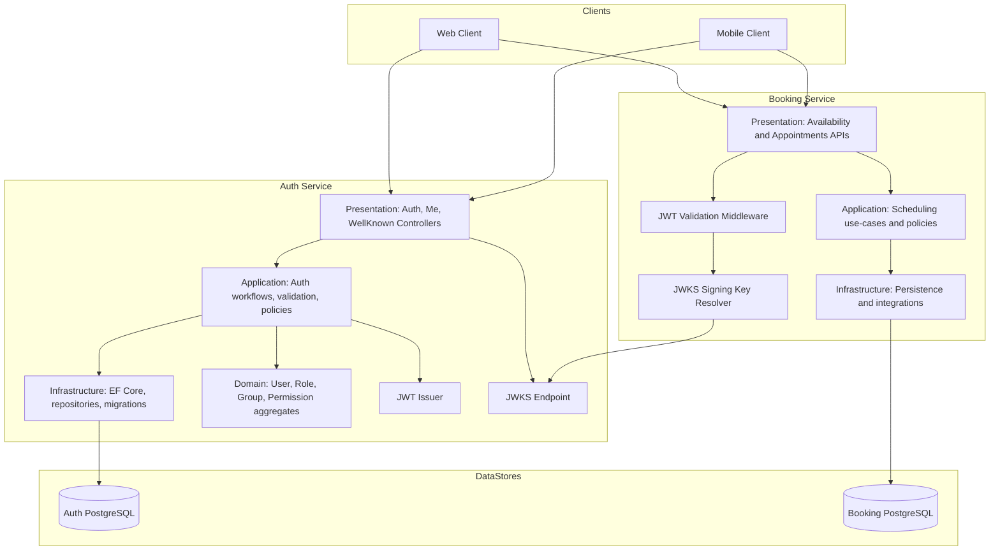

# Auth and Booking Components View

Purpose: Present the runtime component topology for identity and scheduling collaboration.
Status: CURRENT - Reflects implemented Auth and Booking integration.

---

## 1. Component Architecture

## 2. Design Intent

- Auth service is the identity provider and token issuer.
- Booking service is a protected resource API and validates JWT locally.
- Signing keys are discovered through JWKS and reused for token verification.
- Persistence boundaries remain separate between identity and scheduling domains.

## 3. Responsibilities by Service

### Auth Service
- User sign-up, login, refresh, and logout flows.
- Me endpoint for current principal.
- JWKS publication for downstream trust.
- Role/group/permission graph management.

### Booking Service
- JWT authentication and authorization policy enforcement.
- Availability and appointment business workflows.
- Scheduling data consistency and persistence.
