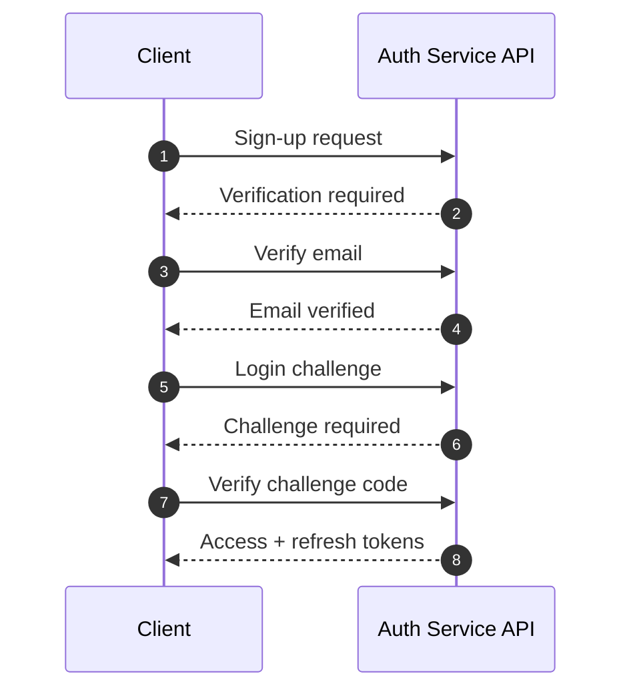
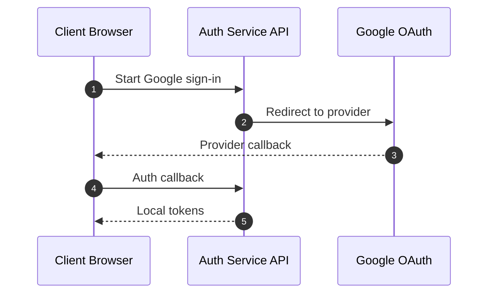
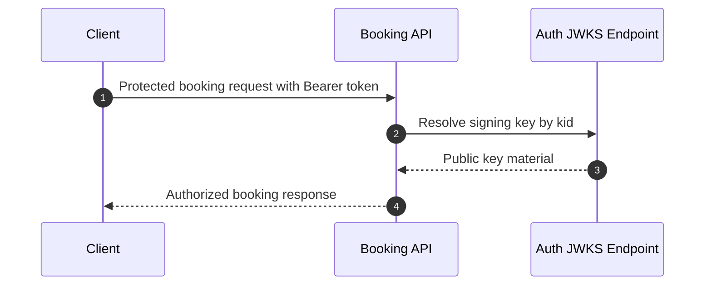
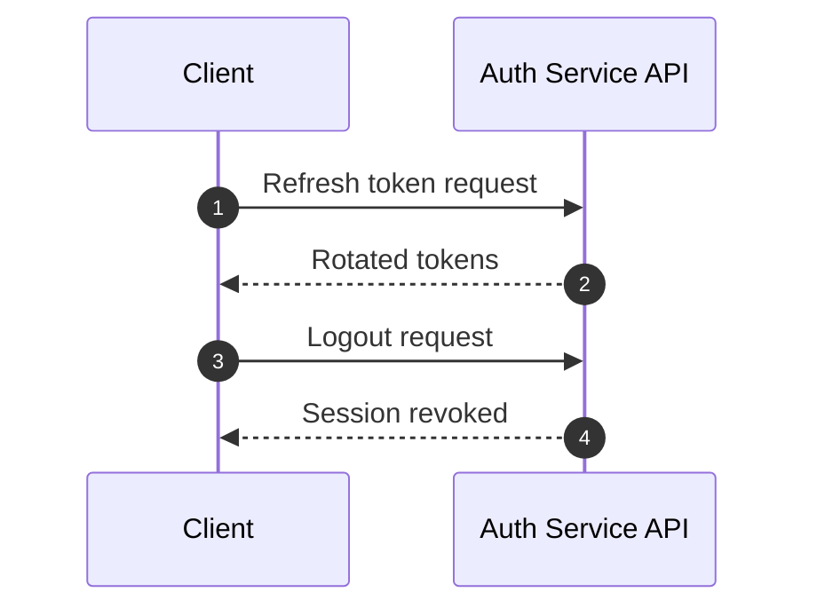
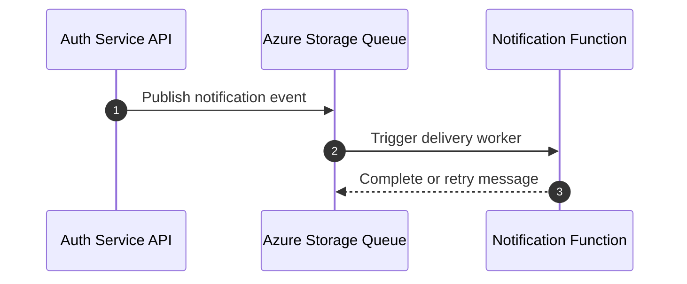

# Auth, Booking, and Notification Sequential Flows View

Purpose: Provide a compact runtime overview for the main auth, booking, and notification flows.
Status: CURRENT - High-level runtime summary only.

For the full behavioral contracts and step-by-step flows, use the feature docs in `docs/FEATURES/AUTHENTICATION_INTEGRATION`.

---

## 1. What This Doc Covers

This file is intentionally narrow:
- service-to-service runtime sequence at a high level
- request boundaries between Auth, Booking, and Notification
- where the reader should go for exact flow behavior

Detailed state transitions, payload shapes, validation branches, and operational edge cases belong in feature docs, not here.

---

## 2. High-Level Runtime Flows

### Sign-up and Login

Reference docs:
- [AUTH_SERVICE_SPEC.md](../FEATURES/AUTHENTICATION_INTEGRATION/AUTH_SERVICE_SPEC.md)
- [AUTH_EMAIL_VERIFICATION_METHODS_AND_SEQUENTIAL_FLOWS.md](../FEATURES/AUTHENTICATION_INTEGRATION/AUTH_EMAIL_VERIFICATION_METHODS_AND_SEQUENTIAL_FLOWS.md)
- [AUTH_OTP_METHODODOLOGY_AND_CHANNEL_STRATEGY.md](../FEATURES/AUTHENTICATION_INTEGRATION/AUTH_OTP_METHODODOLOGY_AND_CHANNEL_STRATEGY.md)

### Google Sign-In

Reference docs:
- [AUTH_GOOGLE_OAUTH_FULL_FLOW.md](../FEATURES/AUTHENTICATION_INTEGRATION/AUTH_GOOGLE_OAUTH_FULL_FLOW.md)

### Booking Authorization

Reference docs:
- [BOOKING_SERVICE_AUTH_INTEGRATION.md](../FEATURES/AUTHENTICATION_INTEGRATION/BOOKING_SERVICE_AUTH_INTEGRATION.md)
- [AUTH_JWT_JWKS_FULL_FLOW.md](../FEATURES/AUTHENTICATION_INTEGRATION/AUTH_JWT_JWKS_FULL_FLOW.md)

### Refresh and Logout

Reference docs:
- [AUTH_JWT_JWKS_FULL_FLOW.md](../FEATURES/AUTHENTICATION_INTEGRATION/AUTH_JWT_JWKS_FULL_FLOW.md)

### Async Notification Dispatch

Reference docs:
- [docs/FEATURES/NOTIFICATION/README.md](../FEATURES/NOTIFICATION/README.md)
- [docs/FEATURES/NOTIFICATION/TROUBLESHOOTING_PLAYBOOK.md](../FEATURES/NOTIFICATION/TROUBLESHOOTING_PLAYBOOK.md)

---

## 3. Architecture Summary

- Auth is the identity provider and token issuer.
- Booking validates JWTs locally and enforces scheduling authorization.
- Notification is asynchronous and side-effect driven.
- JWKS is the trust bridge between Auth and Booking.
- Feature docs hold the exact flow and behavior contracts.

---

## 4. Where to Read the Details

Use the following docs for step-by-step behavior:
- [AUTH_SERVICE_SPEC.md](../FEATURES/AUTHENTICATION_INTEGRATION/AUTH_SERVICE_SPEC.md)
- [AUTH_GOOGLE_OAUTH_FULL_FLOW.md](../FEATURES/AUTHENTICATION_INTEGRATION/AUTH_GOOGLE_OAUTH_FULL_FLOW.md)
- [AUTH_JWT_JWKS_FULL_FLOW.md](../FEATURES/AUTHENTICATION_INTEGRATION/AUTH_JWT_JWKS_FULL_FLOW.md)
- [AUTH_OTP_METHODODOLOGY_AND_CHANNEL_STRATEGY.md](../FEATURES/AUTHENTICATION_INTEGRATION/AUTH_OTP_METHODODOLOGY_AND_CHANNEL_STRATEGY.md)
- [AUTH_EMAIL_VERIFICATION_METHODS_AND_SEQUENTIAL_FLOWS.md](../FEATURES/AUTHENTICATION_INTEGRATION/AUTH_EMAIL_VERIFICATION_METHODS_AND_SEQUENTIAL_FLOWS.md)
- [USER_WORKFLOW_SIGNUP_TO_APPOINTMENT_WITH_AUTH.md](../FEATURES/AUTHENTICATION_INTEGRATION/USER_WORKFLOW_SIGNUP_TO_APPOINTMENT_WITH_AUTH.md)
- [BOOKING_SERVICE_AUTH_INTEGRATION.md](../FEATURES/AUTHENTICATION_INTEGRATION/BOOKING_SERVICE_AUTH_INTEGRATION.md)
- [docs/FEATURES/NOTIFICATION/README.md](../FEATURES/NOTIFICATION/README.md)

---

## 5. Rule of Thumb

If the document answers:
- exact request/response behavior
- token claims
- verification branch logic
- provider-specific steps
- retry and poison queue handling

then it belongs in a feature doc.

If the document answers:
- which service talks to which
- what trust boundary exists
- what the runtime topology looks like

then it belongs here.
