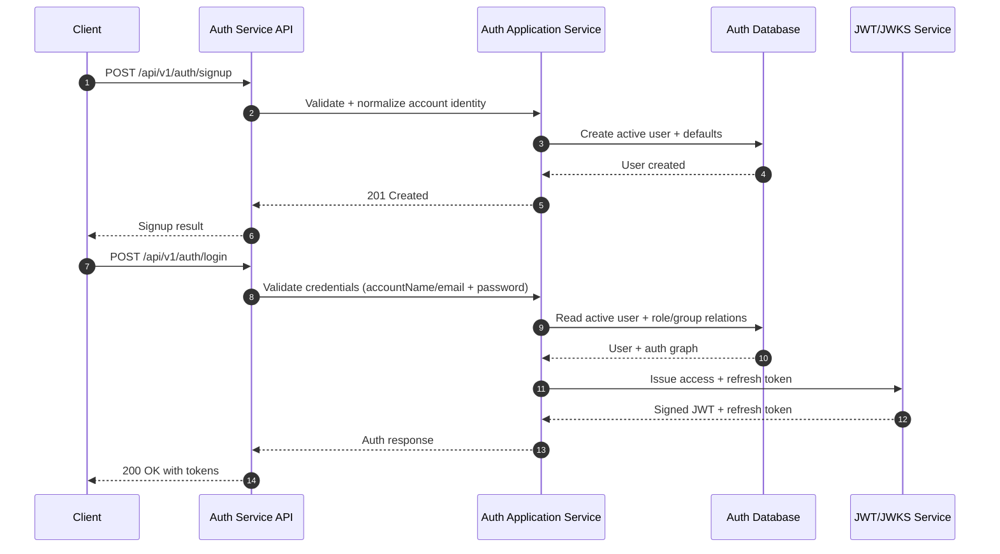
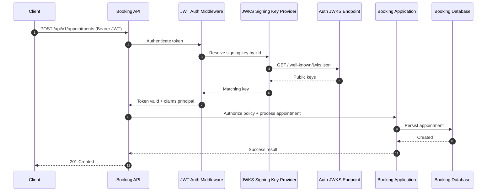
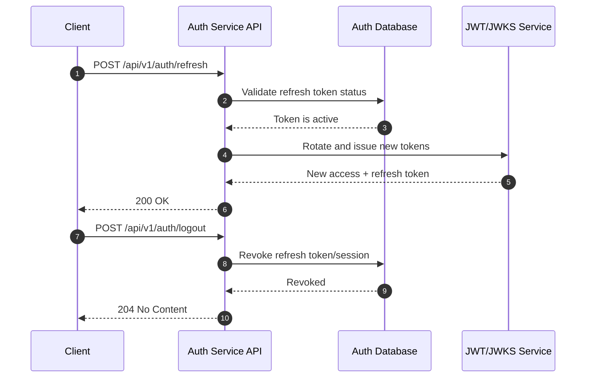

# Auth and Booking Sequential Flows View

Purpose: Describe end-to-end runtime interactions between clients, Auth service, and Booking service.
Status: CURRENT - Reflects implemented flows.

---

## 1. Sign-up and Login Token Issuance

## 2. Booking Request Authorization with JWKS

## 3. Refresh and Logout Lifecycle

