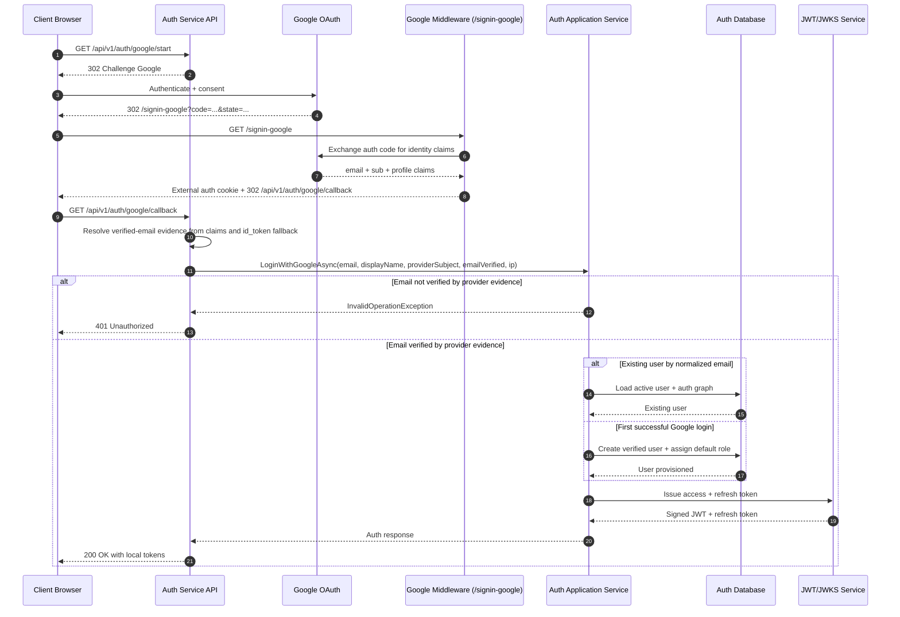
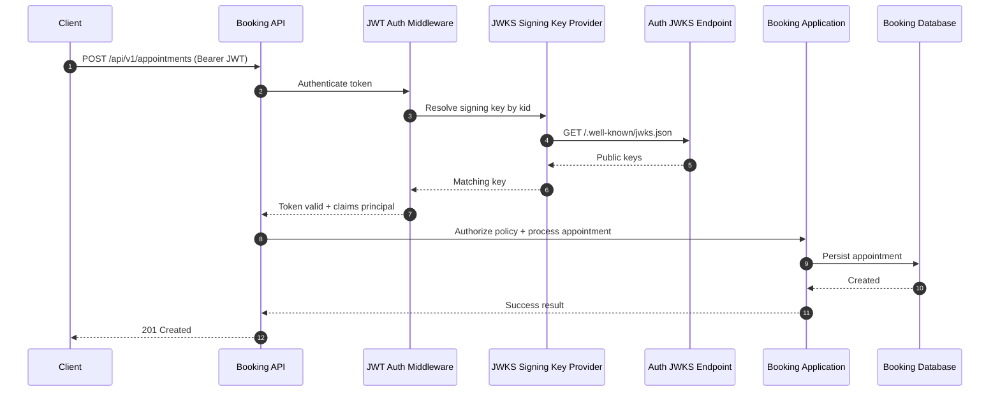
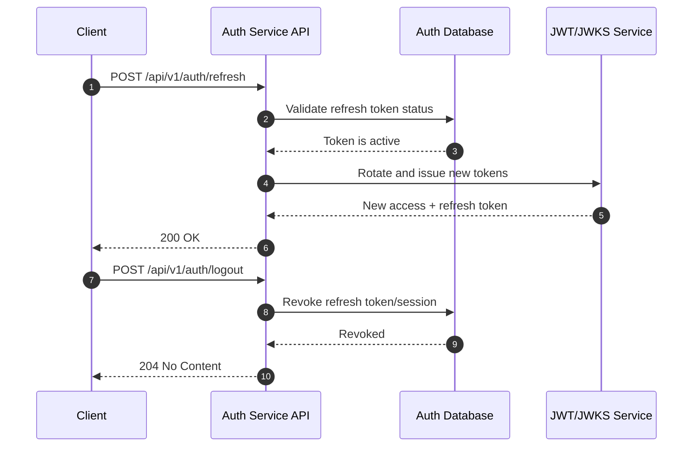
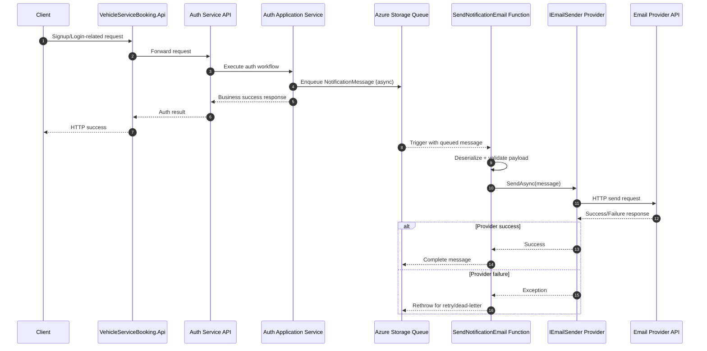
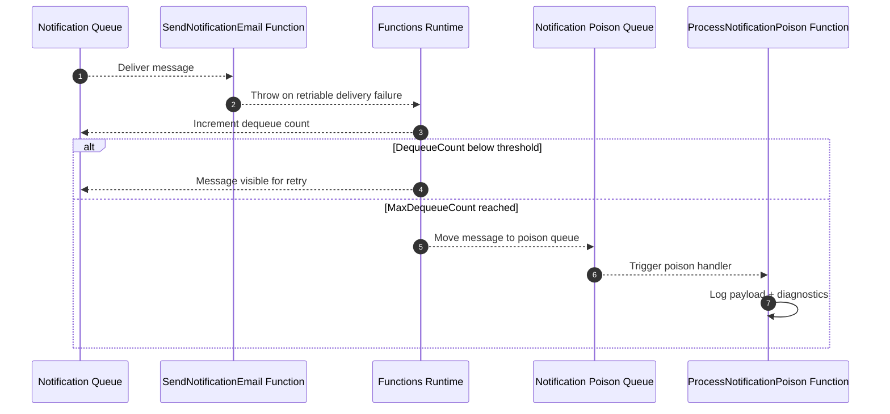

# Auth, Booking, and Notification Sequential Flows View

Purpose: Describe end-to-end runtime interactions between clients, Auth service, Booking service, and Notification service.
Status: CURRENT - Reflects implemented flows.

---

## 1. Sign-up Verification and Two-Step Password Login

```mermaid
sequenceDiagram
    autonumber
    participant Client
    participant AuthAPI as Auth Service API
    participant AuthApp as Auth Application Service
    participant AuthDB as Auth Database
    participant Notify as Notification Queue Publisher
    participant Token as JWT/JWKS Service

    Client->>AuthAPI: POST /api/v1/auth/signup
    AuthAPI->>AuthApp: Validate + normalize account identity
    AuthApp->>AuthDB: Create pending user + verification token hash + expiry
    AuthDB-->>AuthApp: User created
    AuthAPI->>Notify: Publish Auth.EmailVerification.Requested
    AuthApp-->>AuthAPI: Verification metadata
    AuthAPI-->>Client: 202 Accepted (verification required)

    Client->>AuthAPI: GET /api/v1/auth/verify-email?email=...&token=...
    AuthAPI->>AuthApp: VerifyEmailAsync(email, token)
    AuthApp->>AuthDB: Validate token hash + expiry; mark verified; clear token fields
    AuthDB-->>AuthApp: Verification completed
    AuthAPI-->>Client: 200 OK (email verified)

    Client->>AuthAPI: POST /api/v1/auth/login
    AuthAPI->>AuthApp: Validate credentials (accountName/email + password)
    AuthApp->>AuthDB: Read active user + role/group relations
    AuthDB-->>AuthApp: User + auth graph
    AuthApp->>AuthDB: Persist login challenge id + code hash + expiry + attempts
    AuthDB-->>AuthApp: Challenge persisted
    AuthAPI-->>Client: 202 Accepted (challenge required)

    Client->>AuthAPI: POST /api/v1/auth/login/verify-code
    AuthAPI->>AuthApp: Verify challenge id + code + expiry + attempts
    AuthApp->>AuthDB: Consume challenge on success
    AuthDB-->>AuthApp: Challenge consumed
    AuthApp->>Token: Issue access + refresh token
    Token-->>AuthApp: Signed JWT + refresh token
    AuthApp-->>AuthAPI: Auth response
    AuthAPI-->>Client: 200 OK with tokens
```

## 2. Google Sign-In to Local Token Issuance



## 3. Booking Request Authorization with JWKS



## 4. Refresh and Logout Lifecycle



## 5. Async Notification Dispatch and Delivery



## 6. Notification Retry and Poison Lifecycle


