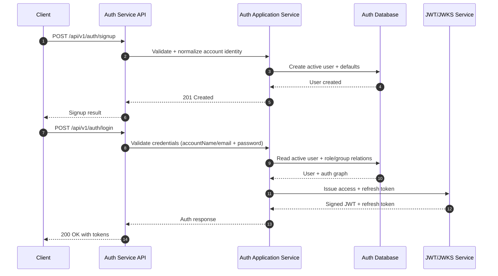
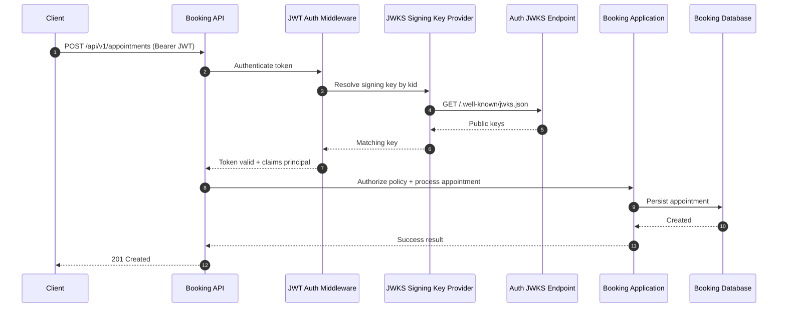
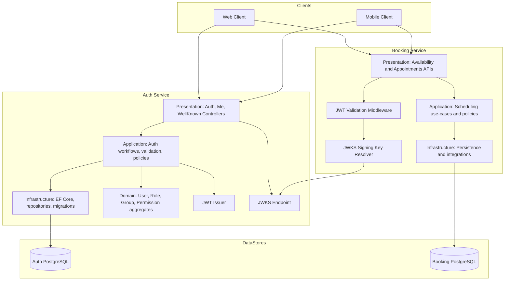

# Auth Service + Booking JWT Integration - Staged Commit Summary

## Commit Title
Auth service foundation + Booking JWT integration + documentation aligned to implemented behavior

## Summary
This change set establishes the Auth service as the identity provider, integrates Booking API JWT validation via JWKS, and updates documentation to mirror currently implemented endpoints and behavior while keeping social/admin APIs marked as planned.

Canonical architecture locations for these diagrams:
- `docs/ARCHITECTURE/AUTH_COMPONENTS_VIEW.md`
- `docs/ARCHITECTURE/AUTH_SEQUENTIAL_FLOW_VIEW.md`

## Sequential Flow

### 1) Sign-up and Login Token Issuance


### 2) Booking Request Authorization with JWKS


## Architecture Components



## Key Implementation Outcomes
- Added a full Auth service foundation and solution integration.
- Implemented core Auth APIs: signup, login, refresh, logout, me, and JWKS.
- Added Auth persistence, service/repository layers, validation, middleware, and migrations.
- Integrated Booking API with JWT authentication and JWKS-based signing key resolution.
- Enforced authorization on protected Booking endpoints.
- Centralized active-record filtering in model configuration, including join entities.
- Updated architecture and authentication docs to match implemented routes and behavior.
- Kept social/admin endpoints documented as planned future scope.

## Scope (Staged)
- 87 files changed
- 8301 insertions
- 2 deletions

## Suggested Commit Message Body (Copy/Paste)
```text
Auth service foundation + Booking JWT integration + documentation aligned to implemented behavior

- Add new Auth service and wire it into the solution.
- Implement core Auth APIs: signup, login, refresh, logout, me, and JWKS endpoint.
- Add Auth persistence, repositories, services, validation, middleware, DI setup, and migrations.
- Add JWT issuance in Auth and JWKS publishing for downstream verification.
- Integrate Booking API with JWT authentication/authorization and JWKS signing-key resolution.
- Protect Booking availability and appointment endpoints with authorization policies.
- Align authentication docs with implemented routes and current behavior.
- Keep social/admin endpoints documented as planned (not implemented).
- Enforce active-only data access centrally via OnModelCreating query filters, including join entities.

Scope: 87 files changed, 8301 insertions(+), 2 deletions(-).
```
