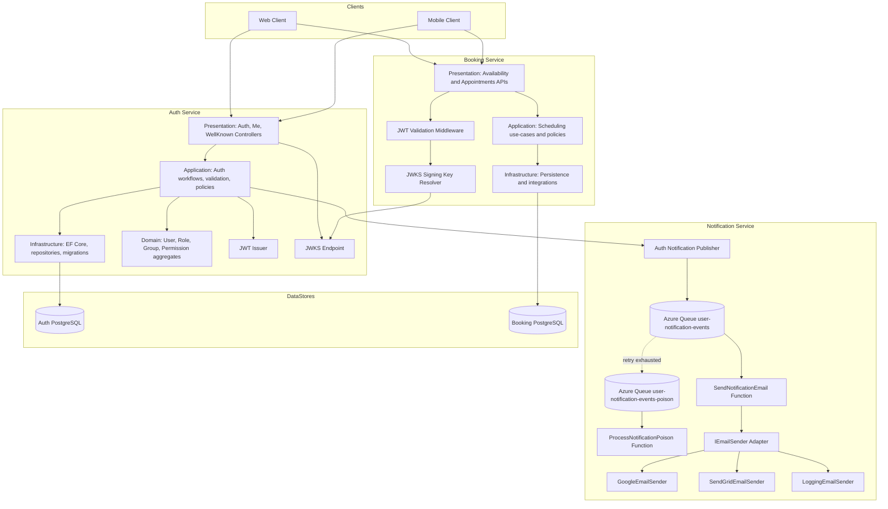

# 🏗️ Conceptual Architecture View

**Purpose:** High-level blueprint of system structure, layer boundaries, service boundaries, and trust topology.
**Architectural Style:** Clean Architecture with Domain-Driven Design (DDD) principles
**Status:** CURRENT - REFLECTS ACTUAL CODEBASE IMPLEMENTATION ✅
**Document Version:** 3.1

---

## 🏛️ 1. LAYERED ARCHITECTURE (CLEAN ARCHITECTURE)

The application isolates core business invariants from external technical infrastructure, frameworks, and databases. Dependencies flow strictly inward toward the Domain Layer.

```
┌──────────────────────────────┐
│      PRESENTATION LAYER      │  Controllers, DTOs, OpenAPI
└──────────────┬───────────────┘
               │ HTTP
               ▼
┌──────────────┴───────────────┐
│      APPLICATION LAYER       │  Interfaces, Biz Services, Validation
└──────────────┬───────────────┘
               │ Implements
               ▼
┌──────────────┴───────────────┐
│     INFRASTRUCTURE LAYER     │  EF Core, Repositories, Observability
└──────────────┬───────────────┘
               │ Mapping
               ▼
┌──────────────┴───────────────┐
│         DOMAIN LAYER         │  Entities, Business Invariants
└──────────────────────────────┘
```

---

## 🔗 2. CROSS-SERVICE ARCHITECTURE (AUTH + BOOKING + NOTIFICATION)

The current production shape is a three-service collaboration model:

- Auth service acts as identity provider and JWT issuer.
- Booking service acts as protected resource API.
- Booking validates JWT locally using keys published by Auth via JWKS.
- Notification service (Azure Functions) acts as asynchronous delivery worker.
- Auth publishes notification events to queue; Notification Functions process delivery via provider adapters.



---

## 🔄 3. RUNTIME FLOW VIEW LINKS

For detailed step-by-step runtime interactions, use:

- `AUTH_SEQUENTIAL_FLOW_VIEW.md` for request sequences.
- `AUTH_COMPONENTS_VIEW.md` for component-level boundaries.
- `../FEATURES/NOTIFICATION/README.md` for notification workflow details.