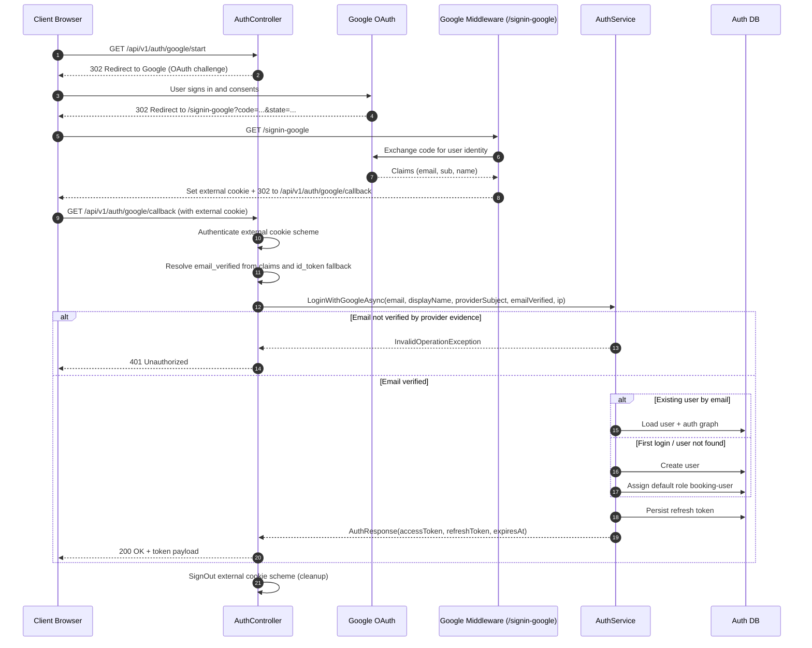

# Auth Google OAuth Full Flow

## Purpose
This document explains the full Google login flow in this repository from user click to Auth API token response.

## Status
Current source of truth for Google login runtime behavior.

It focuses on the runtime path implemented in:
- `AuthController` (`/api/v1/auth/google/start`, `/api/v1/auth/google/callback`)
- Google middleware callback (`/signin-google`)
- `AuthService.LoginWithGoogleAsync(...)`

---

## 1. Endpoints and Roles

- `GET /api/v1/auth/google/start`
  - Starts OAuth challenge to Google.
  - Sets post-auth redirect to `GET /api/v1/auth/google/callback`.

- `GET /signin-google`
  - Middleware callback path (`GoogleOptions.CallbackPath`).
  - Handled by ASP.NET Google auth handler, not by our controller.
  - Validates Google response and signs in a temporary external cookie principal.

- `GET /api/v1/auth/google/callback`
  - Controller endpoint that reads the external cookie principal.
  - Extracts `email`, `sub`/`nameidentifier`, optional display name, and provider email-verification evidence.
  - Calls `LoginWithGoogleAsync(...)`.
  - Returns local `accessToken` + `refreshToken`.

---

## 2. Full Sequence (Client -> Google -> Middleware -> Auth Service)



---

## 3. Workflow View (Decision Focus)

```mermaid
flowchart TD
    A[Client calls /api/v1/auth/google/start] --> B{Google login enabled?}
    B -- No --> B1[409 GOOGLE_LOGIN_DISABLED]
    B -- Yes --> C[Challenge Google]
    C --> D[Google redirects to /signin-google]
    D --> E[Middleware validates OAuth response]
    E --> F{External principal valid?}
    F -- No --> F1[401 Google authentication failed]
    F -- Yes --> G[/api/v1/auth/google/callback]
    G --> H{email claim present?}
    H -- No --> H1[401 missing email]
    H -- Yes --> I{sub/nameidentifier present?}
    I -- No --> I1[401 missing provider subject]
    I -- Yes --> J[Resolve provider email verification evidence]
    J --> J2{Provider email verified?}
    J2 -- No --> J3[401 Google identity email is not verified]
    J2 -- Yes --> K{User exists by normalized email?}
    K -- Yes --> L[Issue local tokens]
    K -- No --> M[Create user + assign booking-user + issue tokens]
    L --> N[200 AuthResponse]
    M --> N
```

---

## 4. Important Distinction: `/signin-google` vs `/google/callback`

- `/signin-google`
  - Provider callback endpoint.
  - Middleware-owned, configured via `CallbackPath`.
  - Must be registered in Google Authorized redirect URIs.

- `/api/v1/auth/google/callback`
  - Application endpoint.
  - Reads external cookie and performs local login/provision/token issuance.
  - Not the Google registered redirect URI in this implementation.

---

## 5. Token Issuance Behavior

`LoginWithGoogleAsync(...)` behavior:
1. Normalize email.
2. If user exists by email -> reuse user.
3. If user does not exist -> create user and assign default role.
4. Generate local access token (JWT) and refresh token.

Result:
- First Google login provisions user.
- Repeated Google logins with same email do not create duplicate users.

---

## 6. Required Configuration

In Auth settings:
- `Authentication:Google:Enabled=true`
- `Authentication:Google:ClientId=<client-id>`
- `Authentication:Google:ClientSecret=<client-secret>`
- `Authentication:Google:CallbackPath=/signin-google`
- Token persistence enabled in Google auth options to allow id_token fallback parsing.

Google Cloud Console OAuth client:
- Application type: Web application
- Authorized redirect URI: `http://localhost:5158/signin-google`

---

## 7. Validation Evidence in Repository

- Callback controller behavior tests:
  - `tests/VehicleServiceBooking.Tests/Auth/Controllers/AuthControllerGoogleTests.cs`
- Provisioning repeatability tests:
  - `tests/VehicleServiceBooking.Tests/Auth/Services/AuthServiceGoogleLoginTests.cs`

These tests validate success/failure callback behavior and no-duplicate-user provisioning for repeated Google logins.

---

## 8. Troubleshooting Guide

### 8.1 409 GOOGLE_LOGIN_DISABLED from `/api/v1/auth/google/start`

Symptom:
- Start endpoint responds with conflict and code `GOOGLE_LOGIN_DISABLED`.

Likely cause:
- `Authentication:Google:Enabled` is false in current environment config.

Fix:
1. Set `Authentication:Google:Enabled=true` in active config.
2. Ensure `ClientId` and `ClientSecret` are also populated when enabled.
3. Restart Auth service after configuration changes.

### 8.2 Redirect mismatch at Google callback

Symptom:
- Google UI returns redirect URI mismatch error.

Likely cause:
- Google OAuth client redirect URI does not exactly match middleware callback path.

Fix:
1. Confirm application uses `Authentication:Google:CallbackPath=/signin-google`.
2. In Google Cloud Console OAuth client, add exact URI:
  - `http://localhost:5158/signin-google` (or your actual host/port).
3. Match scheme, host, port, and path exactly.

### 8.3 401 "Google authentication failed" at `/api/v1/auth/google/callback`

Symptom:
- Callback endpoint returns 401 with generic authentication failure message.

Likely causes:
- External cookie scheme did not contain a successful principal.
- OAuth state/correlation failed or callback was invoked directly.
- Cookie was dropped due host/scheme mismatch between start and callback requests.

Fix:
1. Start flow from `/api/v1/auth/google/start` (do not call callback directly).
2. Keep same browser session for challenge and callback.
3. Ensure Auth service base URL is stable across full flow.

### 8.4 401 "Google identity did not return an email address"

Symptom:
- Callback returns 401 due missing email claim.

Likely cause:
- Provider response lacks usable email claim.

Fix:
1. Confirm Google account and consent include email scope.
2. Inspect claims in callback debugging logs.
3. Ensure claim extraction path (`ClaimTypes.Email` or `email`) is present.

### 8.5 401 "Google identity is missing provider subject"

Symptom:
- Callback returns 401 due missing provider subject (`sub`/nameidentifier).

Likely cause:
- Provider principal mapping failed or unexpected claim set.

Fix:
1. Inspect external principal claims in development logging.
2. Verify subject claim (`ClaimTypes.NameIdentifier` or `sub`) is available.

### 8.6 User created repeatedly concern

Expected behavior in current implementation:
1. First successful callback with a new normalized email provisions one user.
2. Subsequent callbacks with same normalized email reuse existing user.

Verification tests:
- `AuthServiceGoogleLoginTests` validates same email called twice provisions once.
- `AuthControllerGoogleTests` validates callback success/failure controller paths.

If duplicates still appear in runtime:
1. Verify incoming email normalization and casing.
2. Check database uniqueness constraints and existing records.
3. Confirm flow is not hitting a different environment/database than expected.

### 8.7 401 "Google identity email is not verified"

Symptom:
- Callback returns 401 unauthorized with verified-email failure message.

Likely causes:
1. Provider did not return verified-email evidence in mapped claims.
2. id_token fallback unavailable in current callback session.
3. Email is not verified in provider account.

Fix:
1. Restart auth service after OAuth configuration updates.
2. Re-run full browser flow from `/api/v1/auth/google/start`.
3. Confirm provider account email is verified.
