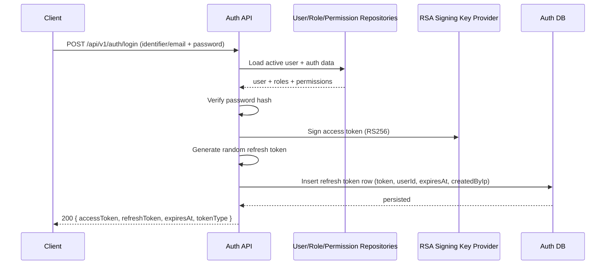
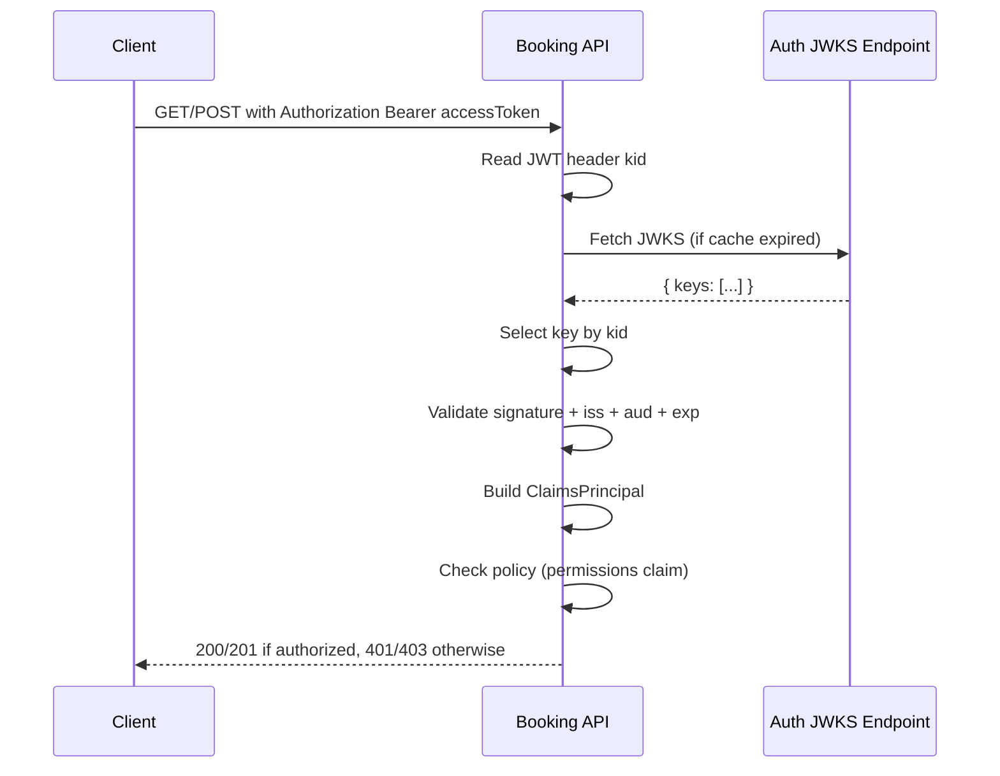

# Auth JWT + Refresh Token + JWKS Full Flow

## Purpose
This document explains the full mechanism from login to:
- access token issuance (signed JWT)
- refresh token issuance (opaque token)
- JWKS public key discovery
- downstream request authorization in Booking API

The goal is to make the flow easy to reason about during implementation, debugging, and API testing.

---

## 1. One-screen mental model

- Auth service signs access tokens with a private RSA key.
- Auth service publishes the matching public key in JWKS.
- Booking API receives bearer token and reads token header kid.
- Booking API fetches/caches JWKS and selects key with same kid.
- Booking API verifies JWT signature and claims (iss, aud, exp).
- If valid, authorization policies check permission claims.

---

## 2. Components and responsibilities

```mermaid
flowchart LR
    U[Client App / HTTP file]
    A[Auth API]
    ADS[(Auth DB)]
    K[RSA Signing Key Provider]
    J[/.well-known/jwks.json]
    B[Booking API]

    U -->|POST /auth/login or /auth/signup| A
    A -->|load user/roles/permissions| ADS
    A -->|sign JWT with private RSA key| K
    A -->|store refresh token row| ADS
    A -->|accessToken + refreshToken| U

    U -->|Authorization Bearer accessToken| B
    B -->|read kid from JWT header| B
    B -->|fetch/cache keys| J
    J -->|public keys only| B
    B -->|verify JWT signature + iss/aud/exp| B
    B -->|policy check permissions claim| B
```

---

## 3. Login to token issuance sequence



What is issued:
- accessToken: signed JWT (self-contained claims)
- refreshToken: opaque random string (state lives in DB)

---

## 4. Access token structure and meaning

A JWT has 3 parts: header.payload.signature

Header fields:
- alg: signing algorithm (RS256)
- typ: JWT
- kid: key id used to choose matching public key

Payload claims in current implementation:
- sub: user id
- email
- display_name
- iat
- roles (multi claim)
- permissions (multi claim)
- iss, aud, exp are also set by token creation parameters

Signature:
- produced by Auth private RSA key
- cannot be forged without private key

---

## 5. Refresh token mechanism

Refresh token is not JWT in this system.

It is:
- random 64-byte value encoded to Base64
- persisted in Auth DB with metadata

Stored fields (conceptually):
- token
- userId
- expiresAt
- revokedAt
- createdByIp
- active state

Refresh behavior:
1. Client calls POST /api/v1/auth/refresh with refreshToken.
2. Auth checks token exists and is usable (active, not revoked, not expired).
3. Old refresh token is revoked.
4. New access token + new refresh token are issued.

This is rotating refresh token behavior.

---

## 6. JWKS publication and key discovery

Auth endpoint:
- GET /api/v1/.well-known/jwks.json

Why public:
- It contains only public key material (for verification), never private key.

JWKS key fields you care about:
- kid: key id
- kty: RSA
- alg: RS256
- use: sig
- n: RSA modulus
- e: RSA exponent

Key matching rule:
- Match access token header kid to JWKS keys[i].kid

---

## 7. Booking API authorization validation sequence



Validation layers in Booking API:
- Authentication:
  - signature valid
  - issuer matches configured Auth issuer
  - audience matches vehicle-booking-api
  - token lifetime valid
- Authorization:
  - endpoint policy requires permission claims

---

## 8. Common outcomes and troubleshooting map

- 401 Unauthorized:
  - malformed token
  - invalid signature
  - unknown issuer/audience
  - expired token
  - missing bearer token

- 403 Forbidden:
  - token valid but missing required permissions claim

- Intermittent signature failures after Auth restart:
  - key id changed (in-memory RSA key regenerated)
  - Booking still uses old token or stale key cache
  - re-login and retry

---

## 9. Practical debugging checklist

1. Decode access token header, check kid exists.
2. Call JWKS endpoint, confirm same kid is present.
3. Confirm Booking AuthJwt settings:
   - issuer
   - audience
   - jwksUrl
4. Confirm token is not expired.
5. Confirm required permission claim exists for endpoint policy.
6. If Auth restarted recently, issue a fresh login token.

---

## 10. Current implementation notes

- Access token signing algorithm: RS256.
- Signing key provider is in-memory per process lifetime.
- JWKS is generated from current in-memory public key.
- Refresh token is opaque and DB-backed.
- Booking API uses JWKS key resolver with cache window.

These details are enough to reason about all request auth paths from login to protected Booking API authorization.

---

## 11. JWT key rotation strategy (defined baseline)

Rotation goals:
- no downtime during key rollover
- existing non-expired tokens continue to validate during overlap window
- deterministic key selection using `kid`

Defined strategy:
1. Maintain one active signing key and at least one previous verification key.
2. Publish all currently valid verification keys in JWKS (`keys[]`).
3. Stamp every access token with the active key `kid` in JWT header.
4. Rotate on schedule (for example every 30 days) with overlap >= max access-token TTL + clock skew.
5. Retire old key only after overlap window elapses.

Booking validation behavior during rotation:
1. Read `kid` from token header.
2. Resolve matching JWKS key by `kid`.
3. If no `kid` match, refresh JWKS once and retry key lookup.
4. If still no match, fail authentication with 401.

Operational notes:
- Keep key history metadata (`kid`, createdAt, activateAt, retireAt) for auditability.
- Alert on repeated `kid not found` validation failures.

---

## 12. JWT key rotation validation coverage plan

Required scenarios:
1. Current key validation: token signed by active key validates.
2. Overlap window validation: token signed by previous key still validates.
3. Unknown kid: token with non-existent kid returns 401.
4. JWKS refresh path: first lookup misses kid, refresh succeeds, token validates.
5. Retirement path: token signed by retired key fails after overlap window.

Suggested test layers:
- Unit tests: key resolver selection, cache invalidation, refresh-on-miss logic.
- Integration tests: Auth JWKS multi-key response + Booking end-to-end authorization outcomes.
- Smoke tests: rotate key in non-prod and verify no outage for active clients.
