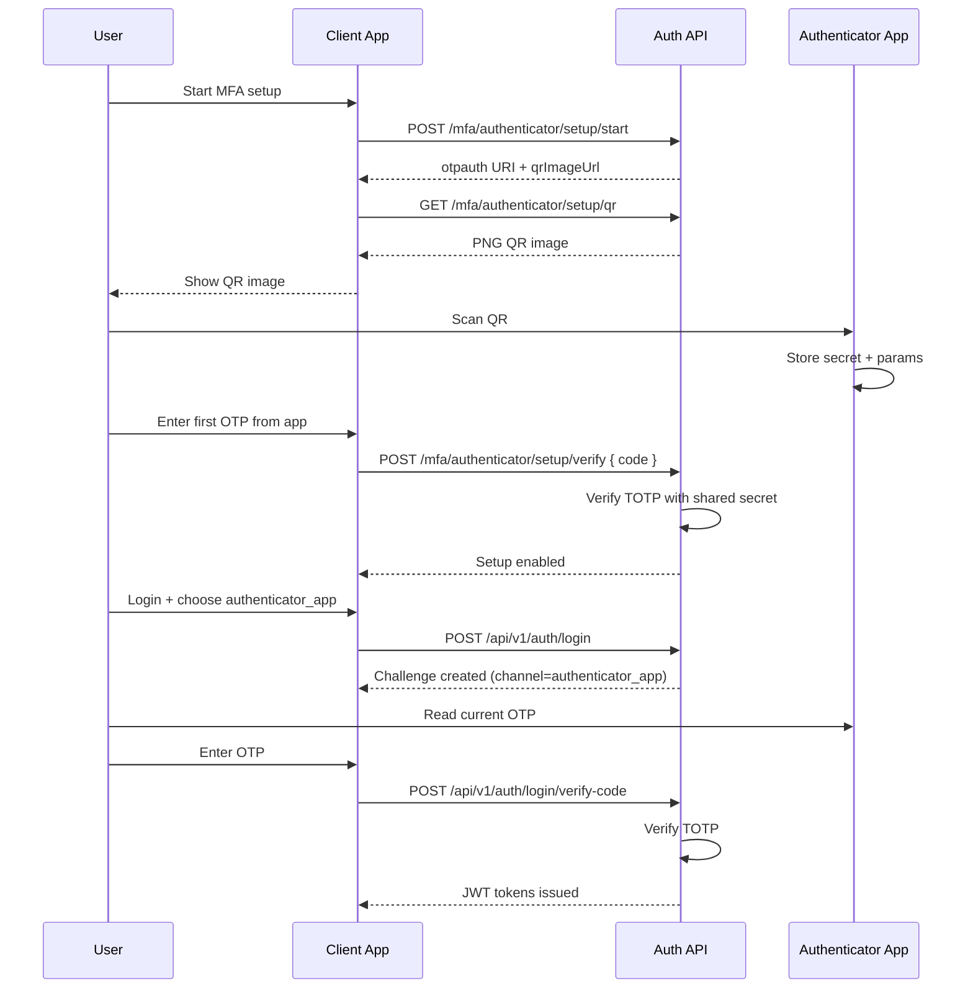

# OTP Methodology And Channel Strategy

Last updated: 2026-07-15

## 1. Purpose

This document defines the One-Time Password (OTP) methodology used by Auth service login challenges, including:

1. Channel model and selection rules.
2. Code generation and verification behavior.
3. Request/response contracts for challenge-based login.
4. Security controls and operational recommendations.

## 2. OTP Channels

Auth service supports three challenge channel values:

1. `otp_first`
2. `email_otp`
3. `authenticator_app`

Channel enum authority:

1. [src/VehicleServiceBooking.Auth/common/enums/ChallengeChannel.cs](../../../src/VehicleServiceBooking.Auth/common/enums/ChallengeChannel.cs)

Wire values are snake_case strings for API and persistence compatibility.

## 3. Methodology Overview

Password login is implemented as a two-step challenge flow.

1. `POST /api/v1/auth/login` validates credentials and creates a challenge.
2. `POST /api/v1/auth/login/verify-code` verifies OTP and issues JWT tokens.

### 3.1 Challenge Creation

At login challenge start:

1. User credentials are validated.
2. Email verification status is enforced.
3. Requested channel is parsed from `challengeChannel`.
4. Channel is resolved using user MFA profile.
5. Challenge metadata is persisted:
   1. `LoginVerificationChallengeId`
   2. `LoginVerificationCodeExpiresAtUtc`
   3. `LoginVerificationCodeAttempts`
   4. `LoginVerificationChannel`

### 3.2 Channel Resolution Rules

When `challengeChannel = otp_first`:

1. If authenticator app is enabled and secret exists, resolved channel becomes `authenticator_app`.
2. Otherwise resolved channel becomes `email_otp`.

When `challengeChannel = authenticator_app`:

1. Authenticator app must be enabled and secret must exist.
2. Otherwise login challenge is rejected.

When `challengeChannel = email_otp`:

1. Resolved channel is `email_otp`.

### 3.3 OTP Material

For `email_otp`:

1. Service generates a random six-digit OTP.
2. Raw OTP is returned only in challenge result for notification publishing.
3. Stored value is hash only (`LoginVerificationCodeHash`).
4. Code expiry is enforced.

For `authenticator_app`:

1. No email OTP is generated.
2. Verification uses TOTP against user authenticator secret.
3. Time-window drift tolerance is applied in TOTP verification utility.

## 4. API Contracts

Authenticator setup endpoints:

1. `POST /api/v1/auth/mfa/authenticator/setup/start`
2. `GET /api/v1/auth/mfa/authenticator/setup/qr`
3. `POST /api/v1/auth/mfa/authenticator/setup/verify`

## 4.1 Start Challenge

Endpoint:

1. `POST /api/v1/auth/login`

Key request fields:

1. `identifier` or `email`
2. `password`
3. `challengeChannel` (`otp_first|email_otp|authenticator_app`)

Accepted response fields:

1. `challengeId`
2. `email`
3. `challengeChannel` (resolved wire value)
4. `verificationCodeExpiresAtUtc`

Behavior:

1. Notification is sent only when resolved channel is `email_otp`.

## 4.2 Verify Challenge

Endpoint:

1. `POST /api/v1/auth/login/verify-code`

Key request fields:

1. `email`
2. `challengeId`
3. `code`

Result:

1. On success, JWT access and refresh tokens are issued.
2. On failure, attempts are incremented and bounded.

## 5. Security Controls

Implemented controls:

1. Challenge expiration check.
2. Fixed max attempt threshold (`LoginVerificationCodeMaxAttempts`).
3. Hash-based storage for email OTP codes.
4. Constant-time comparison for hashed code validation.
5. Email verification prerequisite before login challenge success.
6. Authenticator shared secret encrypted at rest via Data Protection.

Additional recommendations:

1. Add rate limiting for challenge creation and verification endpoints.
2. Add audit log events for challenge failures and lockout thresholds.
3. Add backup codes and authenticator recovery flow.

## 6. Error Semantics

Common rejection conditions:

1. Invalid credentials.
2. Email not verified.
3. Invalid challenge channel value.
4. Authenticator channel requested but not configured.
5. Expired challenge.
6. Max attempts exceeded.
7. Invalid code.

## 7. Integration Notes

Client workflow guidance:

1. Treat login as challenge workflow, not immediate token issuance.
2. Read resolved `challengeChannel` from login response.
3. For `email_otp`, wait for email code delivery before verify request.
4. For `authenticator_app`, prompt user for current app TOTP.

Related integration script:

1. [tests/integration/http/user_workflow_signup_to_appointment_with_auth.http](../../../tests/integration/http/user_workflow_signup_to_appointment_with_auth.http)

## 8. Related Documents

1. [docs/FEATURES/AUTHENTICATION_INTEGRATION/AUTH_SERVICE_SPEC.md](AUTH_SERVICE_SPEC.md)
2. [docs/FEATURES/AUTHENTICATION_INTEGRATION/AUTH_EMAIL_VERIFICATION_METHODS_AND_SEQUENTIAL_FLOWS.md](AUTH_EMAIL_VERIFICATION_METHODS_AND_SEQUENTIAL_FLOWS.md)
3. [docs/FEATURES/AUTHENTICATION_INTEGRATION/USER_WORKFLOW_SIGNUP_TO_APPOINTMENT_WITH_AUTH.md](USER_WORKFLOW_SIGNUP_TO_APPOINTMENT_WITH_AUTH.md)

## 9. otpauth URI Structure

Authenticator-app enrollment is implemented, and the server-generated setup payload includes an `otpauth` URI.

Canonical TOTP format:

```text
otpauth://totp/{label}?secret={base32Secret}&issuer={issuer}&algorithm={algorithm}&digits={digits}&period={periodSeconds}
```

Parameter guidance:

1. `label`: Display label shown in authenticator apps, typically `{Issuer}:{Account}`.
2. `secret`: Shared Base32 secret used for TOTP generation.
3. `issuer`: App/service name; should match issuer used in `label` for consistent app display.
4. `algorithm`: Usually `SHA1` for broad authenticator compatibility.
5. `digits`: Usually `6`.
6. `period`: Usually `30` seconds.

Example:

```text
otpauth://totp/https%3A%2F%2Fauth.vehicle-service-booking.local%3Ahaud.fin%40gmail.com?secret=JBSWY3DPEHPK3PXP&issuer=https%3A%2F%2Fauth.vehicle-service-booking.local&algorithm=SHA1&digits=6&period=30
```

QR payload relation:

1. QR payload is the exact `otpauth` URI string encoded as a QR code.
2. QR code is a transport representation, not a different secret format.
3. Auth API now exposes `GET /api/v1/auth/mfa/authenticator/setup/qr` to return a ready-to-scan `image/png` for the current authenticated user.

Security notes:

1. Treat `secret` and full `otpauth` URI as sensitive.
2. Do not write raw URI or secret to logs.
3. Store secret encrypted at rest immediately when setup is started; decrypt only for verification operations.

## 10. Trust Model and Verification Flow

This section explains how server, client, and authenticator app interact, what is trusted, and how OTP validity is established.

### 10.1 Communication Channels

There are three channels in the flow:

1. Client-Server API channel (HTTPS):
   1. Used for setup start, setup verify, login challenge verify.
2. Provisioning channel (local scan):
   1. Server returns `otpauth` URI to client.
   2. Client can render QR locally from URI, or fetch Auth QR image endpoint.
   3. Authenticator app scans QR locally on user device.
3. User input channel:
   1. User reads app-generated OTP and submits it to server via client HTTPS request.

Important:

1. Authenticator app does not call backend directly for OTP generation.
2. After setup, server and authenticator app are synchronized by shared secret and algorithm parameters.

### 10.2 What Is Trusted

Server trust assumptions:

1. TLS-protected transport between client and server.
2. User is authenticated before starting MFA setup.
3. Enrollment is finalized only after first OTP verification succeeds.
4. Stored secret is protected at rest.

Authenticator app trust assumptions:

1. App receives correct `otpauth` URI via QR scan.
2. Device clock is reasonably synchronized.

### 10.3 How Server Verifies Code

At verification time:

1. Server loads user secret and TOTP parameters.
2. Server computes expected OTP values for current time-window (and allowed drift windows).
3. Server compares submitted code with expected values.
4. If matched, possession of enrolled secret is proven for that user.

Server does not cryptographically identify app brand (Google/Microsoft/Authy).
Server verifies possession of the same shared secret under the same algorithm and time window.

### 10.4 Why This Is Secure Enough For MFA

Security comes from:

1. Secret randomness and secrecy.
2. Short OTP validity window.
3. Attempt limits and bounded retries.
4. Session/challenge binding in login flow.

Recommended controls:

1. Enforce max attempts and lockout/backoff strategy.
2. Add replay protections for challenge verification.
3. Add endpoint rate limiting.
4. Never log OTP, secret, or raw `otpauth` URI.

### 10.5 Sequence Diagram


