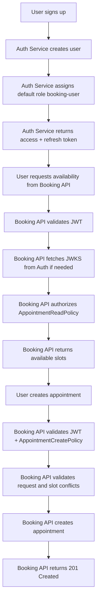
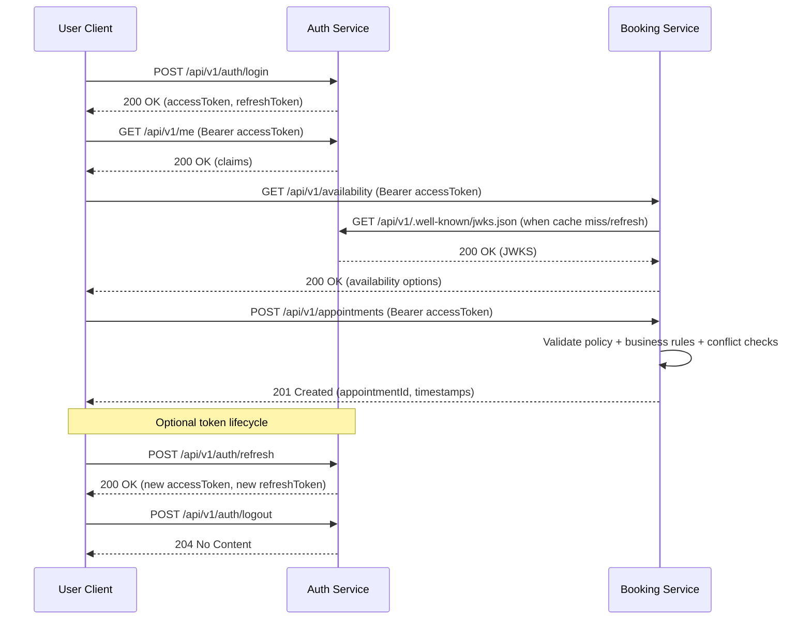

# User Workflow: Sign-Up to Appointment Creation (Auth Integrated)

## 1. Purpose and Scope

This document explains the full user journey from account sign-up to successful appointment creation with Auth service integration.

It covers:
- Workflow diagram (high-level)
- Sequence diagram (request/response interactions)
- Ordered API flow with purpose of each request
- Detailed curl examples for each API in the flow

This guide is intended for developers, testers, and reviewers validating the integrated auth + booking behavior.

## 2. Actors and Services

- User Client: Web/mobile client or API consumer
- Auth Service: Issues and refreshes JWT access tokens
- Booking Service: Validates JWT via JWKS and enforces authorization policies

Default local endpoints used in this document:
- Auth base URL: `http://localhost:5158`
- Booking base URL: `http://localhost:5290`

## 3. Workflow Diagram (High-Level)



## 4. Sequence Diagram (Detailed Interaction)


## 4.1 Sequence Diagram (Login to Create Appointment)



## 5. Ordered API Flow and Purpose

| Step | From -> To | API | Auth Required | Primary Purpose | Typical Success |
|---|---|---|---|---|---|
| 1 | User Client -> Auth | `POST /api/v1/auth/signup` | No | Register user and issue first tokens | `201` |
| 2 | User Client -> Auth | `POST /api/v1/auth/login` | No | Authenticate by AccountName or Email and issue tokens | `200` |
| 3 | User Client -> Auth | `GET /api/v1/me` | Yes (Bearer) | Verify identity and token claims | `200` |
| 4 | User Client -> Booking | `GET /api/v1/availability` | Yes (Bearer) | Find available slots for target service/date | `200` |
| 5 | Booking -> Auth | `GET /api/v1/.well-known/jwks.json` | Internal service call | Obtain signing keys for JWT validation | `200` |
| 6 | User Client -> Booking | `POST /api/v1/appointments` | Yes (Bearer) | Create appointment for selected slot | `201` |
| 7 (optional) | User Client -> Auth | `POST /api/v1/auth/refresh` | No (refresh token in body) | Rotate tokens when access token expires | `200` |
| 8 (optional) | User Client -> Auth | `POST /api/v1/auth/logout` | No (refresh token in body) | Revoke refresh token | `204` |

### 5.1 What `/me` Claims Mean for Booking Permissions

`GET /api/v1/me` helps the client inspect current token claims (such as roles and permissions), but it is not the final authorization decision point for Booking APIs.

Use this rule:
- Client-side: use `/me` claims for UX hints (for example show/hide actions).
- Server-side: Booking API policy checks are the source of truth (`401`/`403` outcomes).

Why this matters:
- Token claims can become stale if permissions change or token is revoked/rotated.
- Only Booking service policy evaluation determines whether an endpoint call is allowed.

Current policy intent in this integration:
- `appointment:view` -> allows `GET /api/v1/availability` and appointment read flows.
- `appointment:create` -> allows `POST /api/v1/appointments`.
- `appointment:complete` -> allows complete/cancel appointment flows.

Current auth login input contract:
- `identifier`: accepts account name or email (preferred input)
- `email`: still accepted for backward compatibility

## 6. Detailed curl Requests (Step-by-Step)

### 6.1 Prepare Environment Variables

```bash
AUTH_BASE="http://localhost:5158"
BOOKING_BASE="http://localhost:5290"
EMAIL="workflow.$(date +%s)@example.com"
ACCOUNT_NAME="workflow_$(date +%s)"
PASSWORD="Test1234!"
```

### 6.2 Sign Up (Issue Initial Tokens)

Purpose:
- Create a user
- Receive `accessToken` and `refreshToken`

```bash
SIGNUP_RESPONSE=$(curl -s -X POST "$AUTH_BASE/api/v1/auth/signup" \
  -H 'Content-Type: application/json' \
  -d "$(printf '{"email":"%s","accountName":"%s","password":"%s","displayName":"Workflow User"}' "$EMAIL" "$ACCOUNT_NAME" "$PASSWORD")")

echo "$SIGNUP_RESPONSE" | jq .

ACCESS_TOKEN=$(echo "$SIGNUP_RESPONSE" | jq -r '.accessToken')
REFRESH_TOKEN=$(echo "$SIGNUP_RESPONSE" | jq -r '.refreshToken')
```

### 6.2.1 Login (Identifier Supports AccountName or Email)

Purpose:
- Authenticate an existing user
- Receive a token pair

Login by account name:

```bash
LOGIN_RESPONSE=$(curl -s -X POST "$AUTH_BASE/api/v1/auth/login" \
  -H 'Content-Type: application/json' \
  -d "$(printf '{"identifier":"%s","password":"%s"}' "$ACCOUNT_NAME" "$PASSWORD")")

echo "$LOGIN_RESPONSE" | jq .
```

Login by email (backward compatible):

```bash
LOGIN_BY_EMAIL_RESPONSE=$(curl -s -X POST "$AUTH_BASE/api/v1/auth/login" \
  -H 'Content-Type: application/json' \
  -d "$(printf '{"email":"%s","password":"%s"}' "$EMAIL" "$PASSWORD")")

echo "$LOGIN_BY_EMAIL_RESPONSE" | jq .
```

### 6.3 Inspect Token Claims via /me

Purpose:
- Confirm token is accepted by Auth service
- Inspect current claims

```bash
curl -s "$AUTH_BASE/api/v1/me" \
  -H "Authorization: Bearer $ACCESS_TOKEN" | jq .
```

### 6.4 Query Availability from Booking Service

Purpose:
- Confirm cross-service JWT validation
- Get candidate slots and resource assignments

```bash
curl -s "$BOOKING_BASE/api/v1/availability?dealershipId=11111111-1111-1111-1111-111111111111&serviceTypeId=44444444-4444-4444-4444-444444444444&date=2026-07-05" \
  -H "Authorization: Bearer $ACCESS_TOKEN" | jq .
```

### 6.5 Create Appointment (Auth-Integrated)

Purpose:
- Create a booking with authenticated/authorized user context
- Enforce `AppointmentCreatePolicy`

Notes:
- `Idempotency-Key` is recommended for safe retries.
- IDs below are sample/debug IDs; replace as needed for your environment.

```bash
IDEMPOTENCY_KEY="appt-$(date +%s)"

curl -s -X POST "$BOOKING_BASE/api/v1/appointments" \
  -H 'Content-Type: application/json' \
  -H "Authorization: Bearer $ACCESS_TOKEN" \
  -H "Idempotency-Key: $IDEMPOTENCY_KEY" \
  -d '{
    "dealershipId": "11111111-1111-1111-1111-111111111111",
    "customerId": "22222222-2222-2222-2222-222222222222",
    "vehicleId": "33333333-3333-3333-3333-333333333333",
    "appointmentDate": "2026-07-05",
    "serviceTypeId": "44444444-4444-4444-4444-444444444444",
    "technicianId": "55555555-5555-5555-5555-555555555555",
    "serviceBayId": "66666666-6666-6666-6666-666666666666",
    "estimatedStartTimeSlotId": "77777777-7777-7777-7777-777777777771",
    "estimatedEndTimeSlotId": "77777777-7777-7777-7777-777777777773"
  }' | jq .
```

### 6.6 Refresh Token (Optional)

Purpose:
- Obtain a fresh access token after expiration

```bash
REFRESH_RESPONSE=$(curl -s -X POST "$AUTH_BASE/api/v1/auth/refresh" \
  -H 'Content-Type: application/json' \
  -d "$(printf '{"refreshToken":"%s"}' "$REFRESH_TOKEN")")

echo "$REFRESH_RESPONSE" | jq .

NEW_ACCESS_TOKEN=$(echo "$REFRESH_RESPONSE" | jq -r '.accessToken')
NEW_REFRESH_TOKEN=$(echo "$REFRESH_RESPONSE" | jq -r '.refreshToken')
```

### 6.7 Logout / Revoke Refresh Token (Optional)

Purpose:
- Revoke refresh token and end refresh capability

```bash
curl -i -X POST "$AUTH_BASE/api/v1/auth/logout" \
  -H 'Content-Type: application/json' \
  -d "$(printf '{"refreshToken":"%s"}' "$NEW_REFRESH_TOKEN")"
```

## 7. Expected Outcomes by Stage

- Sign-up succeeds: user receives valid tokens
- `/me` returns claim payload for bearer token
- Availability request with token returns `200` (without token returns `401`)
- Appointment create request with required permissions returns `201`
- Refresh returns rotated tokens
- Logout revokes refresh token and subsequent reuse should fail

## 8. Troubleshooting Quick Guide

- `401` from Booking API:
  - Check `Authorization: Bearer <token>` header
  - Check auth service JWKS endpoint is reachable
  - Verify token `iss`/`aud` match Booking configuration

- `403` from Booking API:
  - Token is valid but missing required permission claim
  - Verify role-permission mapping includes `appointment:create` and `appointment:view`

- `409` on appointment create:
  - Slot conflict or no longer available; query availability again and retry with a new slot

- `401` on refresh:
  - Refresh token is expired/revoked/reused

## 9. Suggested Reading Order

1. This document (end-to-end operational flow)
2. `AUTH_SERVICE_SPEC.md`
3. `BOOKING_SERVICE_AUTH_INTEGRATION.md`
4. `AUTH_SERVICE_DATA_MODEL.md`
5. `USER_AUTH_AND_SCHEDULING_CHECKLIST.md`
