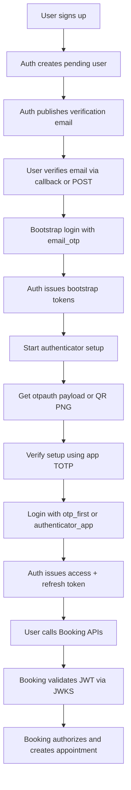
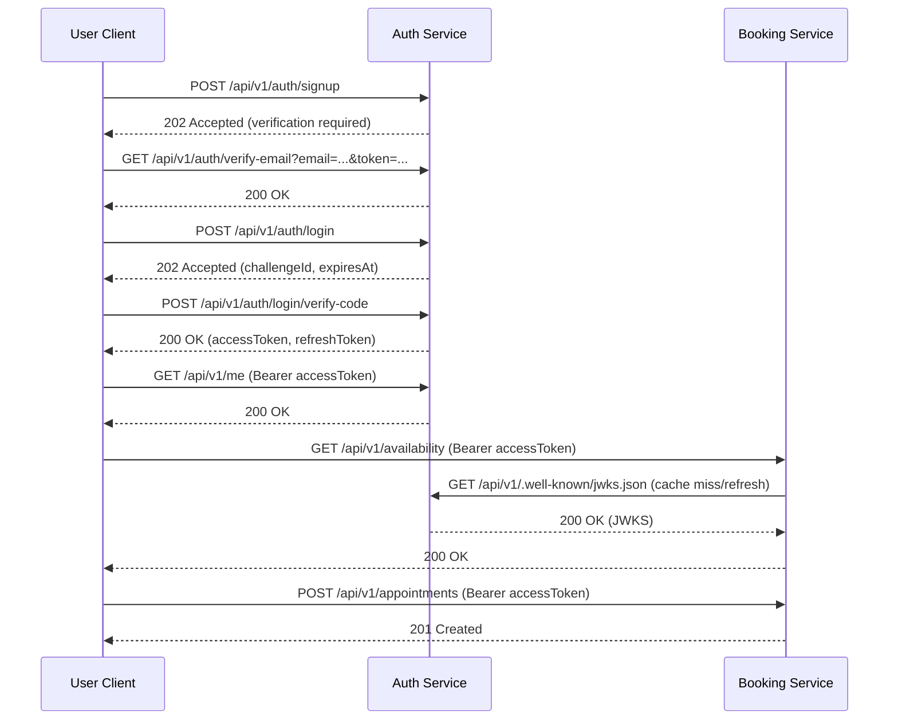

# User Workflow: Sign-Up to Appointment Creation (Verification-First Auth)

## 1. Purpose and Scope

This document describes the implemented end-to-end flow from local sign-up to appointment creation after verification-first authentication hardening.

It reflects the current contract:
1. Sign-up does not issue JWT tokens immediately.
2. User must verify email first.
3. Password login is two-step challenge flow (start + verify code) with channel resolution (`otp_first|email_otp|authenticator_app`).
4. Authenticator app enrollment is available for authenticated users and supports direct QR PNG retrieval.

## 2. Actors and Services

1. User Client: Web/mobile client or API consumer.
2. Auth Service: Identity, verification workflow, JWT/refresh issuance.
3. Booking Service: JWT validation via JWKS and policy enforcement.

Default local endpoints:
1. Auth base URL: http://localhost:5158
2. Booking base URL: http://localhost:5280

## 3. High-Level Workflow

## 4. Sequential Flow

## 5. Ordered API Steps

| Step | API | Typical Success | Notes |
|---|---|---|---|
| 1 | POST /api/v1/auth/signup | 202 | Creates pending user and sends verification email |
| 2 | GET /api/v1/auth/verify-email | 200 | Verifies email from callback link |
| 3 | POST /api/v1/auth/verify-email | 204 | Optional POST fallback verification |
| 4 | POST /api/v1/auth/login | 202 | Bootstrap login challenge (typically `email_otp`) |
| 5 | POST /api/v1/auth/login/verify-code | 200 | Bootstrap token pair issued |
| 6 | POST /api/v1/auth/mfa/authenticator/setup/start | 200 | Returns `otpauthUri`, `qrPayload`, `qrImageUrl` |
| 7 | GET /api/v1/auth/mfa/authenticator/setup/qr | 200 | Optional direct PNG QR image for app scan |
| 8 | POST /api/v1/auth/mfa/authenticator/setup/verify | 200 | Finalizes authenticator enrollment |
| 9 | POST /api/v1/auth/login | 202 | Login challenge using `otp_first` or `authenticator_app` |
| 10 | POST /api/v1/auth/login/verify-code | 200 | Final token pair issued |
| 11 | GET /api/v1/me | 200 | Validates bearer token and claims |
| 12 | GET /api/v1/availability | 200 | Booking API validates JWT via JWKS |
| 13 | POST /api/v1/appointments | 201 | Requires create permission |
| 14 | POST /api/v1/auth/refresh | 200 | Optional token rotation |
| 15 | POST /api/v1/auth/logout | 204 | Optional refresh-token revocation |

## 6. Practical Validation References

Use these HTTP workflow files as source of truth for executable request order:
1. `tests/integration/http/user_workflow_signup_to_appointment_with_auth.http`
2. `tests/integration/http/user_workflow_google_login_to_appointment_with_auth.http`

## 7. Important Contract Notes

1. Signup response includes verification metadata and link, not token pair.
2. Login step 1 returns challenge metadata, including resolved `challengeChannel`.
3. `otp_first` resolves to `authenticator_app` when authenticator MFA is enabled; otherwise resolves to `email_otp`.
4. Authenticator setup start now returns `qrImageUrl` for direct QR PNG retrieval.
5. Google login remains separate and uses provider verification evidence checks.

## 8. Troubleshooting

1. Signup fails with missing verification columns:
Apply pending auth migrations before runtime traffic.

2. Login returns verification required or challenge errors:
Complete verify-email first, then submit login code through /login/verify-code.

3. Google callback returns unverified-email message:
Ensure provider verification evidence is present (claims/id_token fallback) and OAuth settings are current.
