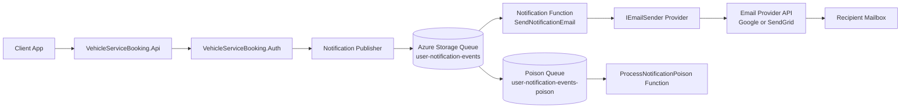
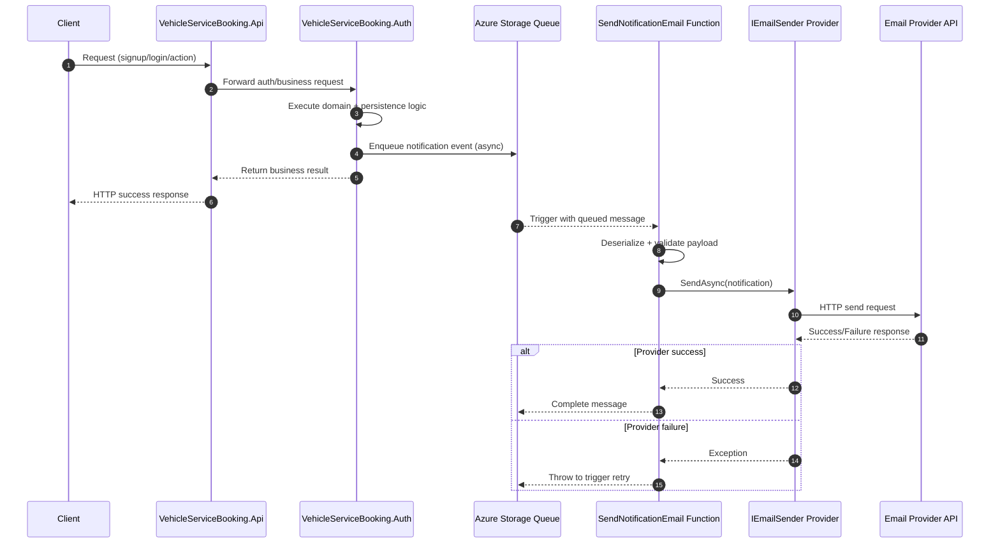
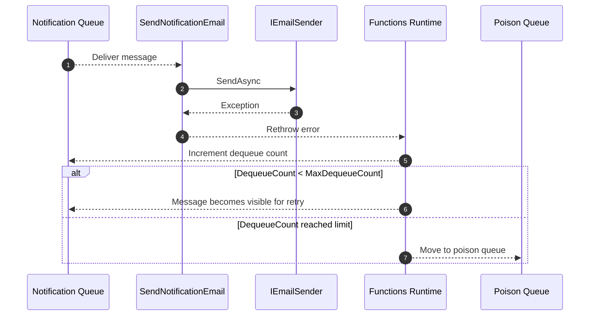

# Notification Feature Architecture and Workflow

## Purpose
This document explains how the notification flow works end-to-end across services:
- client -> api -> auth -> notification function
- queue-based asynchronous delivery
- email provider handoff and success criteria

## 1. Components and Responsibilities

### Client
- Calls API endpoints for sign-up/login/booking-related actions.
- Receives immediate API response without waiting for email delivery.

### VehicleServiceBooking.Api
- Handles client-facing endpoints.
- Delegates identity and account actions to Auth service.

### VehicleServiceBooking.Auth
- Validates business/authentication workflows.
- Publishes notification events to Azure Storage Queue (`NotificationQueueName`).
- Uses fail-safe publish behavior so main request path can complete even when notification delivery has issues.

### Azure Storage Queue (Notification Queue)
- Buffers notification events asynchronously.
- Decouples request latency from email provider latency.
- Provides retry semantics through Azure Functions queue trigger behavior.

### VehicleServiceBooking.Notification.Functions
- Trigger: `SendNotificationEmail` queue trigger.
- Deserializes payload, validates required fields, and calls `IEmailSender` provider implementation.
- Re-throws provider failures to allow retry/dead-letter behavior.

### Email Provider Adapter (`IEmailSender`)
- `LoggingEmailSender`: local/dev-safe no-op sender with logs.
- `SendGridEmailSender`: SendGrid API integration.
- `GoogleEmailSender`: Gmail API integration with token resolution.

### Poison Queue Handler
- `ProcessNotificationPoison` consumes dead-lettered messages from poison queue.
- Logs payload for diagnostics and manual replay decisions.

## 2. End-to-End Architecture Flow

## 3. Cross-Service Sequence Diagram (Client -> API -> Auth -> Notification)

## 4. Notification Function Workflow (Trigger -> Send Success)

1. Queue message arrives on `NotificationQueueName`.
2. `SendNotificationEmail` is invoked by Azure Functions runtime.
3. Function parses JSON payload to `NotificationMessage`.
4. Function validates required fields (`ToEmail`, `Subject`).
5. Function resolves `IEmailSender` from DI based on `EmailSender__Provider`.
6. Provider sends email through selected downstream API.
7. On success, provider logs status metadata (status code, provider message id when available).
8. Function logs `Processed notification message...` and runtime marks message completed.

## 5. Failure and Retry Workflow

## 6. Configuration Keys (Operationally Relevant)
- Queue:
  - `NotificationQueueName`
  - `NotificationPoisonQueueName`
  - `AzureWebJobsStorage`
- Provider selection:
  - `EmailSender__Provider` (`Logging`, `SendGrid`, `Google`)
- SendGrid path:
  - `EmailSender__SendGridApiKey`
  - `EmailSender__SendGridEndpoint`
- Google path:
  - `EmailSender__GoogleClientId`
  - `EmailSender__GoogleClientSecret`
  - `EmailSender__GoogleRefreshToken`
  - `EmailSender__GoogleAccessToken` (optional override)
  - `EmailSender__GoogleApiEndpoint`
  - `EmailSender__GoogleTokenEndpoint`
  - `EmailSender__GoogleUserId`

## 7. Success Signals
- Function execution log includes:
  - `Processed notification message...`
- Provider log includes successful API response details:
  - status code
  - provider message id/thread id (when provider returns them)
- Queue message is completed and no poison movement for that message.

## 8. Troubleshooting
- For common failures, root causes, and exact validation commands, see `docs/FEATURES/NOTIFICATION/TROUBLESHOOTING_PLAYBOOK.md`.
