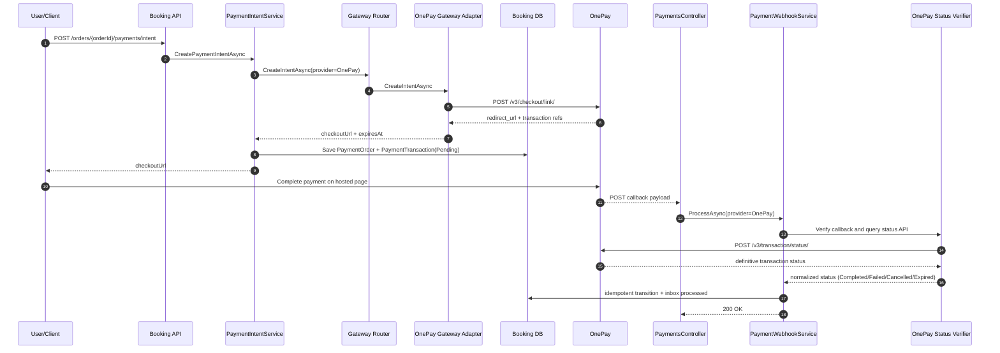

# OnePay Implementation and Architecture Workflow

## Purpose
This document defines a detailed implementation plan for adding OnePay as a real provider path in the current payment architecture.

It is designed to be:
1. A build guide for implementation.
2. A workflow reference for architecture decisions.
3. A handover artifact so the team can resume quickly in future sessions.

## Scope and Non-Goals
In scope:
1. OnePay redirection payment integration using server-to-server API calls.
2. Provider routing, create-intent flow, callback/webhook handling, and status verification.
3. Configuration, security, observability, and tests.

Out of scope for phase 1:
1. OnePay card-on-file automation.
2. OnePay payouts.
3. Multi-provider smart routing or cost-based optimization.

## Current Baseline (As-Is)
Current implementation state:
1. Provider enum already includes OnePay.
2. Real gateway implementation exists for ZaloPay only.
3. Payment router currently routes real traffic only to ZaloPay when enabled.
4. Webhook processing currently uses a shared HMAC signature scheme.
5. Development fallback gateway is available when real provider route is not implemented.

Primary baseline references:
1. src/VehicleServiceBooking.Domain/Enums/PaymentProviderType.cs
2. src/VehicleServiceBooking.Application/Services/PaymentProviderGatewayRouter.cs
3. src/VehicleServiceBooking.Application/Services/ZaloPayPaymentProviderGateway.cs
4. src/VehicleServiceBooking.Application/Services/PaymentWebhookService.cs
5. src/VehicleServiceBooking.Api/appsettings.Development.json

## OnePay Functional Model (To-Be)
OnePay redirection API model:
1. Create transaction using POST /v3/checkout/link/.
2. Generate request hash with SHA-256 over app_id + currency + amount + hash_salt.
3. Receive redirect URL from create response and return it as checkoutUrl.
4. Receive callback payload after customer action.
5. Verify final payment state using OnePay transaction status API /v3/transaction/status/.

Design implication:
1. For OnePay, callback payload should be treated as trigger signal.
2. Final success/failure decision should come from status API verification.

## Target Architecture

### Logical Components
1. PaymentIntentService (existing): orchestrates intent create/reuse.
2. PaymentProviderGatewayRouter (update): routes OnePay provider to OnePay gateway.
3. OnePayPaymentProviderGateway (new): create-transaction implementation.
4. OnePayStatusVerifier (new or integrated into webhook service): confirms status via OnePay API.
5. PaymentWebhookService (update): provider-specific verification strategy.

### Provider-Specific Verification Strategy
Introduce a provider verification abstraction:
1. IPaymentWebhookVerificationStrategy
2. ZaloPayWebhookVerificationStrategy
3. OnePayWebhookVerificationStrategy

Benefits:
1. Avoids mixing provider-specific cryptography and callback semantics in one service.
2. Supports future providers without rewriting webhook core workflow.
3. Keeps PaymentWebhookService focused on orchestration and transitions.

## End-to-End Runtime Workflow (OnePay)

## Detailed Implementation Workstreams

### Workstream 1. Configuration and Options
Add OnePay options under PaymentProviderGateway.

Proposed structure:
1. PaymentProviderGateway.OnePay.Enabled
2. PaymentProviderGateway.OnePay.BaseUrl
3. PaymentProviderGateway.OnePay.CreateCheckoutPath
4. PaymentProviderGateway.OnePay.StatusPath
5. PaymentProviderGateway.OnePay.AppId
6. PaymentProviderGateway.OnePay.HashSalt
7. PaymentProviderGateway.OnePay.Currency
8. PaymentProviderGateway.OnePay.RedirectUrl
9. PaymentProviderGateway.OnePay.CallbackUrl
10. PaymentProviderGateway.OnePay.RequestTimeoutSeconds
11. PaymentProviderGateway.OnePay.IntentTtlMinutes

Validation rules at startup:
1. Enabled=true requires non-empty BaseUrl, AppId, HashSalt, RedirectUrl.
2. Currency must be supported by OnePay integration profile.
3. Timeout and TTL must be positive integers.

Files to update:
1. src/VehicleServiceBooking.Application/Configuration/PaymentProviderGatewayOptions.cs
2. src/VehicleServiceBooking.Api/Configuration/ApplicationOptionsExtensions.cs
3. src/VehicleServiceBooking.Api/appsettings.json
4. src/VehicleServiceBooking.Api/appsettings.Development.json
5. .env.example

### Workstream 2. OnePay Gateway Adapter (Create Intent)
Create OnePayPaymentProviderGateway implementing IPaymentProviderGateway.

Behavior:
1. Accept only provider=OnePay.
2. Validate supported method mapping for initial phase.
3. Format amount to exact string expected by hash and request body.
4. Build hash SHA-256(app_id + currency + amount + hash_salt).
5. POST JSON body to OnePay create endpoint.
6. Map redirect_url (or equivalent response field) to checkoutUrl.
7. Return expiry using IntentTtlMinutes or provider-provided expiry if available.

Error handling:
1. Non-2xx -> throw InvalidOperationException with provider message.
2. Success=false or missing redirect URL -> throw InvalidOperationException.
3. Log provider request correlation fields only, never secrets.

Files to add/update:
1. src/VehicleServiceBooking.Application/Services/OnePayPaymentProviderGateway.cs
2. src/VehicleServiceBooking.Api/Configuration/ApplicationServicesExtensions.cs
3. tests/VehicleServiceBooking.Tests/Application/Services/OnePayPaymentProviderGatewayTests.cs

### Workstream 3. Gateway Router Support
Update router to route OnePay when enabled.

Routing logic:
1. if provider=ZaloPay and ZaloPay.Enabled -> ZaloPay gateway
2. if provider=OnePay and OnePay.Enabled -> OnePay gateway
3. else fallback if UseDevelopmentGatewayFallback=true
4. else fail closed

Files to update:
1. src/VehicleServiceBooking.Application/Services/PaymentProviderGatewayRouter.cs

### Workstream 4. Webhook and Callback Verification
Implement provider-specific callback verification and status confirmation for OnePay.

Recommended behavior for OnePay:
1. Accept callback payload.
2. Deduplicate by provider + event/transaction id.
3. Query OnePay status API using app_id + onepay_transaction_id.
4. Derive normalized internal status from status API response.
5. Persist PaymentWebhookInbox, PaymentTransaction, PaymentOrder, and Order state atomically.

Security model:
1. Keep current PaymentWebhookSecurity for generic baseline.
2. Add OnePay-specific verification path via status API.
3. Do not rely only on client redirect query params.

Files to add/update:
1. src/VehicleServiceBooking.Application/Services/PaymentWebhookService.cs
2. src/VehicleServiceBooking.Application/Interfaces/Services (new verification strategy contract)
3. tests/VehicleServiceBooking.Tests/Application/Services/PaymentWebhookServiceOnePayTests.cs

### Workstream 5. Provider-to-Method Constraints
Explicitly constrain allowed method mappings for OnePay phase 1.

Recommended initial mapping:
1. OnePay -> CreditCard

Optional later mapping:
1. OnePay -> AtmCardDomestic (if business and provider contract confirm)
2. OnePay -> EWallet (if API/merchant profile supports)

Validation points:
1. Payment intent creation rejects unsupported provider-method pairs.
2. API returns clear INVALID_OPERATION message.

### Workstream 6. Observability and Audit
Add provider-aware telemetry:
1. Log create-intent attempts with provider, method, orderId, intentCode.
2. Log callback processing with provider event id, dedupe result, final status.
3. Add timing metrics for create endpoint call and status verification call.

Sensitive-data handling:
1. Never log HashSalt.
2. Mask provider transaction IDs when needed for shared logs.

### Workstream 7. Test Strategy

Unit tests:
1. Hash generation correctness.
2. Create-intent response mapping.
3. Router dispatch for OnePay enabled/disabled/fallback behavior.
4. Unsupported method guard.

Integration tests:
1. Payment intent create/reuse with OnePay provider lookup data.
2. Webhook dedupe race behavior with OnePay callback identifiers.
3. Status-API-driven transition update behavior.

Contract tests:
1. Example OnePay callback payload deserialization.
2. Example OnePay status API response mapping.

Verification commands:
1. dotnet build src/VehicleServiceBooking.Api/VehicleServiceBooking.Api.csproj
2. dotnet test tests/VehicleServiceBooking.Tests/VehicleServiceBooking.Tests.csproj --filter "OnePay|PaymentIntentService|PaymentWebhookService"

## Configuration Matrix

### Development Sandbox
1. BaseUrl: sandbox endpoint from OnePay dashboard/docs.
2. AppId: sandbox app id.
3. HashSalt: sandbox hash salt.
4. RedirectUrl: local frontend route for return UX.
5. CallbackUrl: public callback endpoint (ngrok/dev tunnel for local).

### Production
1. BaseUrl: live OnePay API endpoint.
2. AppId: production app id.
3. HashSalt: production hash salt (secret manager only).
4. RedirectUrl: production customer return URL.
5. CallbackUrl: production webhook URL with TLS and allowlist controls.

## Data and State Mapping

OnePay status to internal transaction status mapping (proposed):
1. success/paid -> Completed
2. failed/declined -> Failed
3. cancelled_by_user -> Cancelled
4. expired/timeout -> Expired
5. unknown/pending -> Pending

Order/payment roll-up mapping follows current PaymentWebhookService transitions.

## Rollout Workflow

Phase A. Build and internal validation:
1. Implement Workstreams 1-3.
2. Run unit tests and build.
3. Demo checkout URL generation in sandbox.

Phase B. Callback correctness and security:
1. Implement Workstream 4.
2. Validate callback ingestion and status verification.
3. Run webhook race and dedupe tests.

Phase C. Operational readiness:
1. Implement Workstreams 5-6.
2. Add dashboards/alerts for callback failure and status drift.
3. Execute production readiness checklist.

Phase D. Controlled release:
1. Enable OnePay with feature flag/config in staging.
2. Run smoke scenarios and reconciliation checks.
3. Enable in production with fallback disabled after confidence window.

## Production Readiness Checklist
1. OnePay live credentials issued and stored in secret manager.
2. Callback endpoint reachable publicly via HTTPS.
3. Callback source validation and status API verification working.
4. OnePay provider/method seed rows active in database.
5. Alerting configured for webhook failures and repeated reconciliation mismatches.
6. Runbook added for manual reconciliation and replay.

## Risk Register
1. Risk: callback payload not sufficient for trust.
   Mitigation: mandatory status API verification before final transition.
2. Risk: hash mismatch due to amount formatting.
   Mitigation: central formatter with deterministic tests.
3. Risk: fallback hides missing real integration in production.
   Mitigation: disable UseDevelopmentGatewayFallback in production.
4. Risk: environment misconfiguration.
   Mitigation: startup validation and fail-fast options checks.

## Resume-Next-Time Checklist
Use this section as quick continuation notes.

1. Confirm current branch and latest payment commits.
2. Validate if any provider abstraction changes happened since this document.
3. Start with Workstream 1 and commit in small slices:
   - Slice 1: options + validation + appsettings
   - Slice 2: gateway adapter + unit tests
   - Slice 3: router wiring + integration tests
   - Slice 4: webhook verification strategy + regression tests
4. Update docs/FEATURES/PAYMENT/PAYMENT_PROGRESS_CHECKLIST.md update log after each slice.

## Suggested Commit Sequence
1. feat(payment): add OnePay gateway options and startup validation
2. feat(payment): implement OnePay create-intent adapter
3. feat(payment): route OnePay through payment gateway router
4. feat(payment): add OnePay callback status verification workflow
5. test(payment): add OnePay gateway and webhook verification coverage
6. docs(payment): finalize OnePay integration workflow and rollout notes

## Reference Sources
1. OnePay API overview: https://docs.onepay.lk/api-documentation
2. OnePay authentication: https://docs.onepay.lk/api-documentation/authentication
3. OnePay redirection payment API: https://docs.onepay.lk/api-documentation/payment-api
4. Existing payment plan: docs/FEATURES/PAYMENT/PAYMENT_IMPLEMENTATION_PLAN.md
5. Existing payment contracts: docs/FEATURES/PAYMENT/PAYMENT_API_CONTRACTS.md