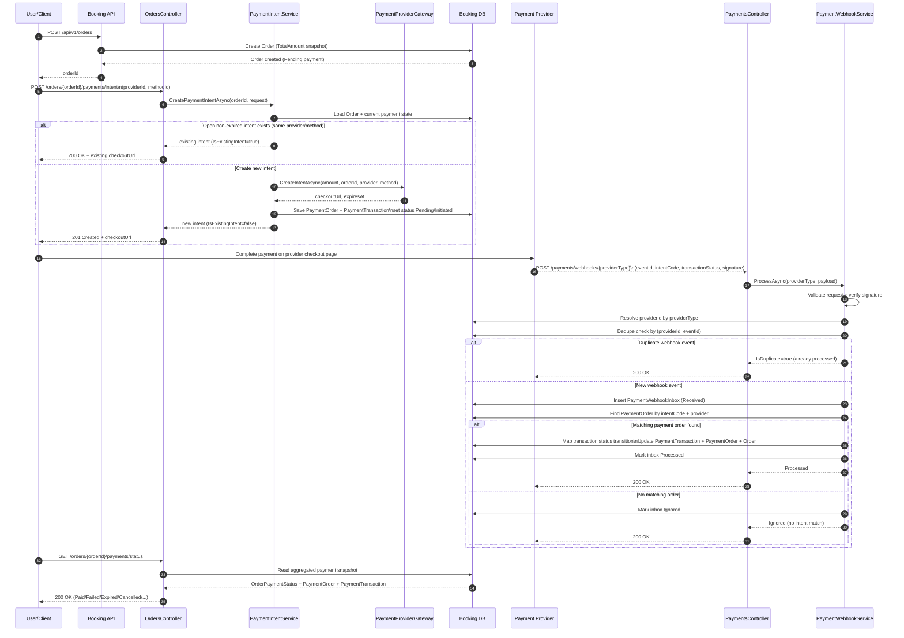

# Payment Feature Implementation Plan

## Goal
Complete end-to-end payment behavior where:
1. Order.TotalAmount remains the authoritative charge snapshot.
2. Payment intent is created after order creation.
3. Provider webhook finalizes payment state.
4. Database and SQL mirror stay aligned through migration-driven changes.

## End-to-End Runtime Sequence

### Main Success Flow (Client Selects Provider -> Order Paid)

### Status Transition Summary
1. Order created: `OrderPaymentStatus = Pending`.
2. Intent created/reused: `PaymentIntentStatus = Initiated/Redirected`, `PaymentTransactionStatus = Pending`.
3. Provider success webhook: `PaymentTransactionStatus = Completed`, `PaymentIntentStatus = Paid`, `OrderPaymentStatus = Paid`.
4. Provider failure/timeout/cancel webhook: transitions to `Failed`/`Expired`/`Cancelled` respectively.
5. Duplicate webhook: no state mutation (idempotent dedupe response).

## Final Design Decisions
1. Provider external IDs are string values.
2. Internal entity IDs remain Guid values.
3. Webhook dedupe uses composite uniqueness: PaymentProviderId + ProviderEventId.
4. Provider and method are separate dimensions using lookup tables.
5. Payment intent lifecycle naming uses PaymentIntentStatus.
6. Development-stage schema refactor is allowed and preferred over compatibility shims.

## Phase Plan

### Phase 1. Domain Refactor
Objective:
Define payment entities and statuses to support intent creation, transaction capture, and webhook processing.

Scope:
1. Order payment state fields and invariants.
2. PaymentOrder intent lifecycle fields.
3. PaymentTransaction provider event and failure detail fields.
4. PaymentWebhookInbox entity for dedupe and processing state.
5. Lookup enums/entities for order payment status, intent status, webhook status, and transaction status.

Exit criteria:
1. Domain entities compile.
2. Naming is unambiguous between order status and intent status.

Current status: Completed.

### Phase 2. EF Mapping and Seed Alignment
Objective:
Map all payment entities, constraints, relationships, and lookup seed data in ApplicationDbContext.

Scope:
1. Map new columns and relationships for Order, PaymentOrder, PaymentTransaction.
2. Map PaymentWebhookInbox table and foreign keys.
3. Add indexes:
   - PaymentOrder.IntentCode unique
   - PaymentTransaction (PaymentProviderId, ProviderEventId) unique
4. Seed static lookup rows for all lookup tables.

Exit criteria:
1. All payment lookup DbSets have matching HasData initialization.
2. Mapping and index rules compile and match domain intent.

Current status: Completed.

### Phase 3. Migration, Backfill, and SQL Mirror
Objective:
Apply schema changes safely to development data and keep SQL mirror files exact.

Scope:
1. Create EF migration for payment refactor.
2. Ensure backfill happens before FK enforcement.
3. Apply migration to local database.
4. Regenerate SQL mirrors in database/migrations/ef.

Exit criteria:
1. Migration applies successfully.
2. No orphan FK rows in Orders, PaymentOrders, PaymentTransactions.
3. SQL mirror contains the same migration chain and new migration script.

Current status: Completed.

### Phase 4. Application Payment Services
Objective:
Implement business flows for intent creation, webhook processing, and status querying.

Scope:
1. PaymentIntentService:
   - create/reuse intent for order
   - initialize PaymentOrder + PaymentTransaction
2. PaymentWebhookService:
   - verify and dedupe webhook events
   - apply status transitions safely
3. PaymentStatusQueryService:
   - aggregate payment status by order and intent
4. Provider adapter abstraction:
   - isolate provider-specific HTTP/signature logic

Exit criteria:
1. Service interfaces and concrete implementations exist.
2. Status transitions are idempotent and concurrency-safe.

Current status: Not started.

### Phase 5. API Endpoints
Objective:
Expose payment capabilities through API contracts.

Scope:
1. POST /api/v1/orders/{orderId}/payments/intent
2. GET /api/v1/orders/{orderId}/payments/status
3. POST /api/v1/payments/webhooks/{providerType}
4. Optional GET /api/v1/payments/return (UX-only)

Exit criteria:
1. Endpoints wired to service layer.
2. Validation and authorization rules in place.
3. Idempotent behavior for repeated calls/events.

Current status: Not started.

### Phase 6. Tests and Verification
Objective:
Protect payment flow with automated coverage and deterministic validation.

Scope:
1. Domain/service transition tests.
2. Controller/integration tests for intent, status, and webhook.
3. Webhook dedupe and replay tests.
4. Migration/data checks for uniqueness and FK consistency.

Exit criteria:
1. Test suites pass.
2. Critical transitions and idempotency paths are covered.

Current status: Not started.

## Execution Order
1. Phase 4
2. Phase 5
3. Phase 6

## Step-by-Step Approval Gate
1. Implement one phase.
2. Run build and targeted verification.
3. Update checklist.
4. Request explicit approval before starting the next phase.

## Risk and Mitigation Notes
1. Duplicate provider callbacks:
   - Mitigate with PaymentWebhookInbox uniqueness and idempotent handlers.
2. Constraint failures on existing data:
   - Mitigate with pre-FK backfill statements in migration.
3. Status drift between Order, PaymentOrder, PaymentTransaction:
   - Mitigate with centralized transition service and transactional updates.
