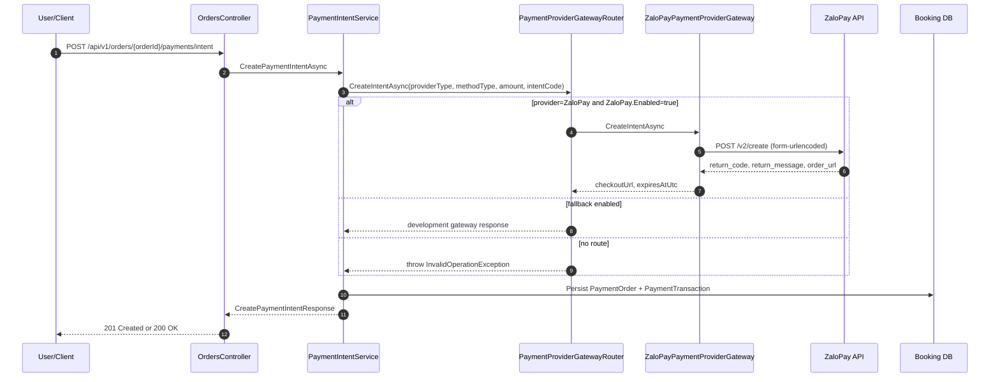

# ZaloPay Implementation and Architecture Workflow (As Implemented)

## Purpose
This document records the current ZaloPay integration exactly as implemented in code.

It is intended to be:
1. A precise architecture and behavior snapshot.
2. A maintenance handover reference.
3. A drift-prevention document for future changes.

## Scope of Current Implementation
Implemented now:
1. Real gateway integration for create-intent using ZaloPay create order API.
2. Provider-aware routing between real ZaloPay gateway and development fallback gateway.
3. Config binding and startup validation for ZaloPay options.
4. ZaloPay callback validation using key2 (`data` + `mac`) through provider-specific ingress.
5. Provider-side transaction reconciliation using ZaloPay query order API (`/v2/query`) before state transition.
6. Focused tests for ZaloPay gateway, ingress normalization, and controller callback acknowledgment behavior.
7. End-to-end sandbox verification using the manual callback workflow script when provider callback routing is unavailable.

Not implemented yet:
1. Bank-list API integration (`getlistmerchantbanks`) for dynamic channel/bank selection.
2. Redirect checksum validation on return endpoint (`checksum` verification with key2).
3. Refund/cancel APIs.
4. Real gateway support for non-ATM methods.
5. Structured telemetry for provider latency and error taxonomy.

## Source of Truth Files
1. [src/VehicleServiceBooking.Application/Configuration/PaymentProviderGatewayOptions.cs](../../../src/VehicleServiceBooking.Application/Configuration/PaymentProviderGatewayOptions.cs)
2. [src/VehicleServiceBooking.Application/Services/ZaloPayPaymentProviderGateway.cs](../../../src/VehicleServiceBooking.Application/Services/ZaloPayPaymentProviderGateway.cs)
3. [src/VehicleServiceBooking.Application/Services/PaymentProviderGatewayRouter.cs](../../../src/VehicleServiceBooking.Application/Services/PaymentProviderGatewayRouter.cs)
4. [src/VehicleServiceBooking.Api/Configuration/ApplicationServicesExtensions.cs](../../../src/VehicleServiceBooking.Api/Configuration/ApplicationServicesExtensions.cs)
5. [src/VehicleServiceBooking.Api/Configuration/ApplicationOptionsExtensions.cs](../../../src/VehicleServiceBooking.Api/Configuration/ApplicationOptionsExtensions.cs)
6. [src/VehicleServiceBooking.Api/appsettings.Development.json](../../../src/VehicleServiceBooking.Api/appsettings.Development.json)
7. [src/VehicleServiceBooking.Application/Services/ZaloPayWebhookIngressService.cs](../../../src/VehicleServiceBooking.Application/Services/ZaloPayWebhookIngressService.cs)
8. [src/VehicleServiceBooking.Api/Controllers/PaymentsController.cs](../../../src/VehicleServiceBooking.Api/Controllers/PaymentsController.cs)
9. [tests/VehicleServiceBooking.Tests/Application/Services/ZaloPayPaymentProviderGatewayTests.cs](../../../tests/VehicleServiceBooking.Tests/Application/Services/ZaloPayPaymentProviderGatewayTests.cs)
10. [tests/VehicleServiceBooking.Tests/Application/Services/ZaloPayWebhookIngressServiceTests.cs](../../../tests/VehicleServiceBooking.Tests/Application/Services/ZaloPayWebhookIngressServiceTests.cs)
11. [tests/VehicleServiceBooking.Tests/Api/Controllers/PaymentsControllerZaloPayTests.cs](../../../tests/VehicleServiceBooking.Tests/Api/Controllers/PaymentsControllerZaloPayTests.cs)
12. [tests/integration/http/payment_workflow_with_zalopay_gateway_manual_callback.http](../../../tests/integration/http/payment_workflow_with_zalopay_gateway_manual_callback.http)

## Runtime Architecture (Current)

### Components
1. PaymentIntentService builds provider request and calls IPaymentProviderGateway.
2. PaymentProviderGatewayRouter decides between:
   - ZaloPayPaymentProviderGateway (real), or
   - DevelopmentPaymentProviderGateway (fallback).
3. ZaloPayPaymentProviderGateway performs signed create-order call to ZaloPay.
4. PaymentsController routes ZaloPay webhook payload to ZaloPayWebhookIngressService.
5. ZaloPayWebhookIngressService validates callback MAC with key2 and queries `/v2/query` to determine final status.
6. PaymentWebhookService applies dedupe + transactional state transitions using normalized internal webhook request.
7. PaymentIntentService persists PaymentOrder and PaymentTransaction with returned checkout URL.
8. PaymentIntentService returns CheckoutQrPayload for client-side QR rendering (current value mirrors checkoutUrl).

### Sequence

## Configuration Model (Current)

### PaymentProviderGateway Options
Current shape:
1. UseDevelopmentGatewayFallback
2. ZaloPay.Enabled
3. ZaloPay.BaseUrl
4. ZaloPay.CreateOrderPath
5. ZaloPay.QueryOrderPath
6. ZaloPay.AppId
7. ZaloPay.Key1
8. ZaloPay.Key2
9. ZaloPay.AppUserPrefix
10. ZaloPay.CallbackUrl
11. ZaloPay.RedirectUrl
12. ZaloPay.IntentTtlMinutes
13. ZaloPay.RequestTimeoutSeconds

### Startup Validation
When ZaloPay.Enabled=true, startup requires:
1. BaseUrl is non-empty.
2. AppId > 0.
3. Key1 is non-empty.
4. Key2 is non-empty.
5. CallbackUrl is non-empty.

Validation note:
1. RedirectUrl is used by gateway payload but is not currently validated at startup.

### Development Defaults
Current development defaults are configured under PaymentProviderGateway in:
1. [src/VehicleServiceBooking.Api/appsettings.Development.json](../../../src/VehicleServiceBooking.Api/appsettings.Development.json)

## ZaloPay Create-Intent Behavior (Exact)

### Preconditions
Gateway enforces:
1. request.PaymentProviderType must be ZaloPay.
2. request.PaymentMethodType must be AtmCardDomestic.
3. options.ZaloPay.Enabled must be true.
4. amount must be greater than zero.

### Amount Handling
1. Amount is rounded to whole number using midpoint-away-from-zero.
2. Result is sent as integer provider amount.
3. Code comment states VND whole-number provider boundary.

### Identifier Construction
1. app_trans_id format: yyMMdd_{intentSuffix}
2. intentSuffix: intentCode without dashes, truncated to 24 chars.
3. app_user format: {prefix}_{orderIdN}
4. app_user max length: 64 chars.

### Embedded Data
embed_data JSON currently includes:
1. redirecturl
2. intentCode
3. orderId

### MAC Calculation
Current signing data format:
1. appId|appTransId|appUser|amount|appTime|embedData|item
2. item is fixed to []
3. HMAC SHA256 with Key1
4. Output lowercase hex string

### Outbound Request Payload
POST body is application/x-www-form-urlencoded with fields:
1. app_id
2. app_user
3. app_time
4. amount
5. app_trans_id
6. embed_data
7. item
8. description
9. bank_code (fixed to ATM)
10. callback_url
11. mac

### Response Handling
Success criteria:
1. HTTP status is success (2xx).
2. JSON deserializes.
3. return_code == 1.
4. order_url is present.

Returned to application:
1. CheckoutUrl = order_url
2. ExpiresAtUtc = now + IntentTtlMinutes

Returned by payment intent API (application layer):
1. checkoutUrl
2. checkoutQrPayload (current implementation mirrors checkoutUrl)
3. intentCode and payment status metadata

Failure behavior:
1. Non-2xx -> InvalidOperationException with response body.
2. Empty/invalid JSON -> InvalidOperationException.
3. return_code != 1 or missing order_url -> InvalidOperationException.

## Router Behavior (Exact)
Decision order in PaymentProviderGatewayRouter:
1. If provider is ZaloPay and ZaloPay.Enabled=true -> use real ZaloPay gateway.
2. Else if UseDevelopmentGatewayFallback=true -> use development gateway.
3. Else -> throw InvalidOperationException: no real gateway configured.

## DI and HTTP Client Wiring
Current registration:
1. Typed HttpClient for ZaloPayPaymentProviderGateway.
2. BaseAddress set from ZaloPay.BaseUrl when not empty.
3. Timeout set to max(1, RequestTimeoutSeconds).
4. IPaymentProviderGateway resolved as PaymentProviderGatewayRouter.

## Interaction with Payment Intent Service
PaymentIntentService provides to gateway:
1. orderId
2. intentCode
3. amount
4. currencyId
5. paymentProviderId
6. paymentMethodId
7. paymentProviderType (from lookup)
8. paymentMethodType (from lookup)

Post-gateway persistence behavior:
1. Creates or updates PaymentOrder for intent.
2. Creates PaymentTransaction with Pending status.
3. Sets order payment status to Pending.
4. Reuses existing non-expired intent only when provider+method match and status is Initiated/Redirected.

## Webhook Relationship to ZaloPay (Current)
Current webhook pipeline for ZaloPay is provider-specific at ingress + generic at core processing:
1. ZaloPay callback envelope (`data`, `mac`) is validated with key2 in ZaloPayWebhookIngressService.
2. Ingress calls `/v2/query` using key1 to reconcile final provider status.
3. Ingress normalizes payload to internal ProcessPaymentWebhookRequest and forwards to PaymentWebhookService.
4. PaymentWebhookService still uses shared internal signature validation when enabled, then applies existing dedupe and transactional transitions.
5. PaymentsController returns provider-compatible acknowledgment body:
    - success: return_code=1
    - duplicate: return_code=2
    - invalid mac: return_code=-1
    - temporary/internal error: return_code=0

Implication:
1. Intent creation and callback-to-reconciliation path are both real-provider integrated for ZaloPay.
2. Remaining gaps are optional integration enhancements, not blockers for main sandbox flow.

## Tests That Currently Cover ZaloPay Path
Unit tests in [tests/VehicleServiceBooking.Tests/Application/Services/ZaloPayPaymentProviderGatewayTests.cs](../../../tests/VehicleServiceBooking.Tests/Application/Services/ZaloPayPaymentProviderGatewayTests.cs):
1. Throws for unsupported payment method.
2. Maps successful provider response to checkout URL and expiry.

Unit tests in [tests/VehicleServiceBooking.Tests/Application/Services/ZaloPayWebhookIngressServiceTests.cs](../../../tests/VehicleServiceBooking.Tests/Application/Services/ZaloPayWebhookIngressServiceTests.cs):
1. Rejects invalid callback MAC.
2. Normalizes valid callback and verifies query API mapping to internal webhook request.

Controller tests in [tests/VehicleServiceBooking.Tests/Api/Controllers/PaymentsControllerZaloPayTests.cs](../../../tests/VehicleServiceBooking.Tests/Api/Controllers/PaymentsControllerZaloPayTests.cs):
1. Returns ZaloPay-compatible callback ack for successful flow.
2. Returns invalid-mac callback ack when signature validation fails.

Recent targeted test run in workspace context includes:
1. PaymentIntentServiceIntegrationTests
2. PaymentWebhookServiceIntegrationTests
3. PaymentWebhookServiceTransactionTests
4. ZaloPayPaymentProviderGatewayTests

## Validated End-to-End Scenario (Current)
Validated in this repository using:
1. [tests/integration/http/payment_workflow_with_zalopay_gateway_manual_callback.http](../../../tests/integration/http/payment_workflow_with_zalopay_gateway_manual_callback.http)

Validated outcomes:
1. Real create-intent path returns checkoutUrl and checkoutQrPayload for client-side QR flow.
2. Manual callback request (`data` + `mac`) is accepted when MAC is computed from the exact posted payload.
3. Payment status endpoint confirms webhook processing effects.

Critical callback integrity rule:
1. `embed_data.intentCode` used for MAC generation must exactly match the posted callback payload string.

## Operational Notes
1. Keep UseDevelopmentGatewayFallback=true in development while enabling real provider incrementally.
2. Disable fallback in production to fail closed when misconfigured.
3. Keep Key1 outside source control and inject by environment/secret store.
4. Ensure callback endpoint is reachable when ZaloPay.Enabled=true.

## Known Gaps and Next Hardening Candidates
These are not implemented yet and should be tracked explicitly:
1. Bank-list API integration (`getlistmerchantbanks`) to support dynamic channel selection.
2. Redirect checksum validation on return endpoint (`checksum` verification with key2).
3. Additional method support beyond ATM domestic.
4. Structured metrics for provider latency and error taxonomy.
